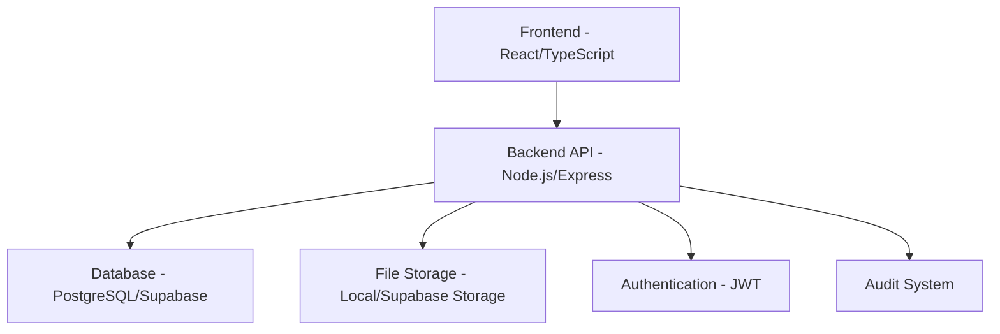
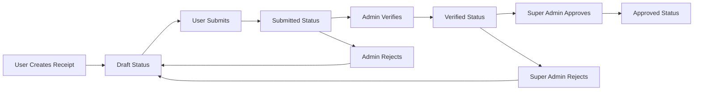
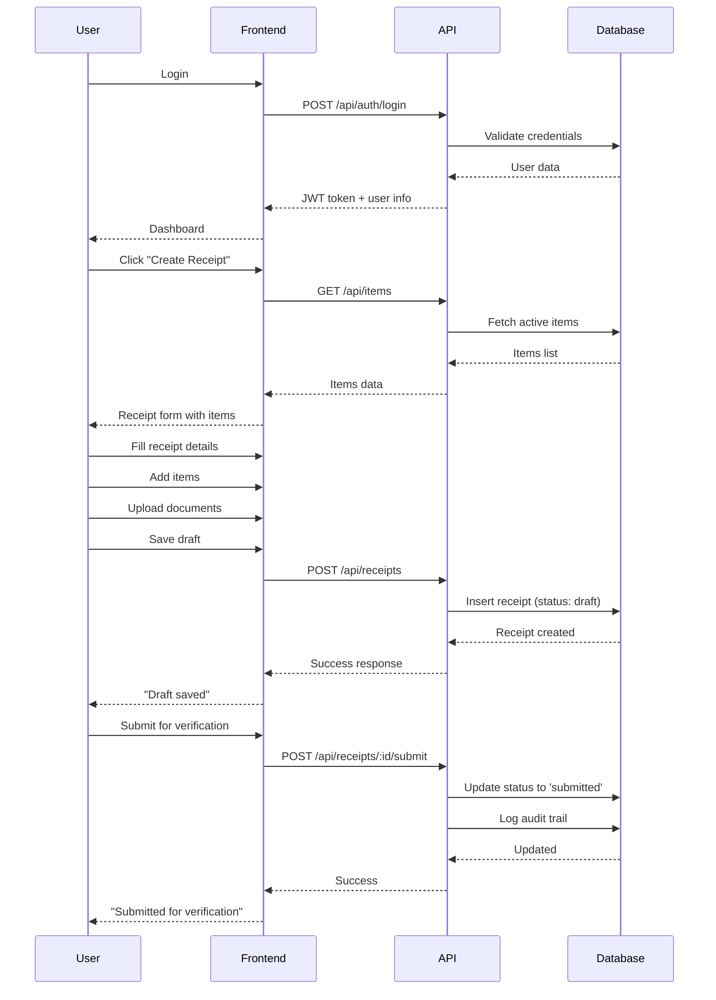
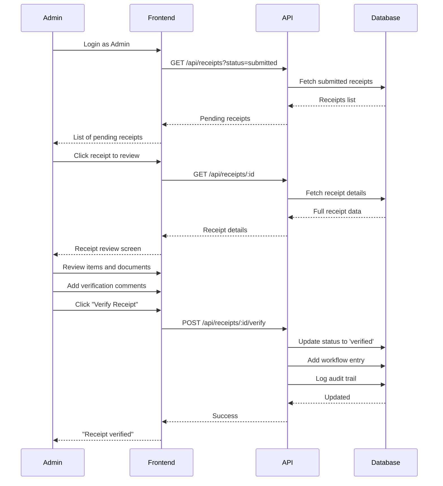
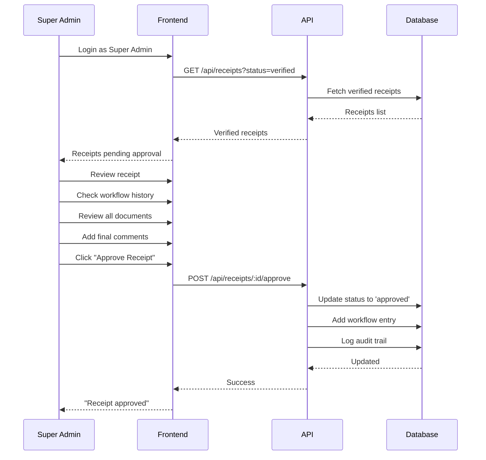
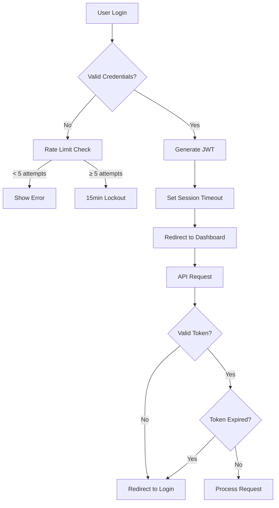
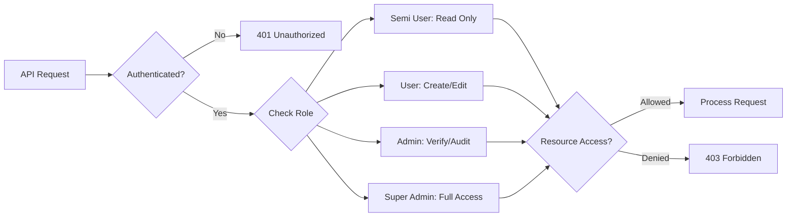

# 📋 Quarter Master Inventory System - Application Flow & Demo Guide

A comprehensive guide to the application workflow, user journeys, and system interactions.

## 🎯 System Overview

The Quarter Master Inventory Management System is designed for military/police organizations to track government property with a multi-level approval workflow.

### 🏗️ Architecture Overview



---

## 👥 User Roles & Permissions

| Role | Permissions | Primary Functions |
|------|-------------|-------------------|
| **Semi User** | View Only | Monitor receipts, view reports |
| **User** | Create & Edit | Data entry, create receipts |
| **Admin** | Verify & Audit | Verify receipts, manage items |
| **Super Admin** | Full Control | Final approval, user management |

---

## 🔄 Core Workflow - Stock Receipt Process



---

## 🖥️ Application Screens & Wireframes

### 1. Login Screen

```
┌─────────────────────────────────────┐
│        Quarter Master Inventory     │
│                                     │
│  ┌─────────────────────────────────┐│
│  │         LOGIN FORM              ││
│  │                                 ││
│  │  Username: [________________]   ││
│  │  Password: [________________]   ││
│  │                                 ││
│  │        [LOGIN BUTTON]           ││
│  │                                 ││
│  │  Default: admin / Admin@123     ││
│  └─────────────────────────────────┘│
└─────────────────────────────────────┘
```

**Features:**
- JWT-based authentication
- Rate limiting (5 attempts, 15min lockout)
- Session timeout after 30 minutes
- Secure password validation

---

### 2. Dashboard (Main Screen)

```
┌─────────────────────────────────────────────────────────────┐
│ [Logo] Quarter Master Inventory    [Profile] [Logout]       │
├─────────────────────────────────────────────────────────────┤
│ [Dashboard] [Receipts] [Items] [Users] [Reports] [Audit]    │
├─────────────────────────────────────────────────────────────┤
│                                                             │
│  📊 STATISTICS CARDS                                        │
│  ┌──────────┐ ┌──────────┐ ┌──────────┐ ┌──────────┐      │
│  │   📦     │ │    ⏰    │ │    ✅    │ │    ⚠️    │      │
│  │  Total   │ │ Pending  │ │Approved  │ │ Pending  │      │
│  │Receipts  │ │Submissions│ │Receipts  │ │Approvals │      │
│  │   150    │ │    12    │ │   120    │ │    18    │      │
│  └──────────┘ └──────────┘ └──────────┘ └──────────┘      │
│                                                             │
│  📈 RECENT ACTIVITY                                         │
│  ┌─────────────────────────────────────────────────────────┐│
│  │ GRN/2024/0001 | Office Chair | Approved | 2 days ago   ││
│  │ GRN/2024/0002 | A4 Paper     | Pending  | 1 day ago    ││
│  │ GRN/2024/0003 | Desktop PC   | Verified | 3 hours ago  ││
│  └─────────────────────────────────────────────────────────┘│
│                                                             │
│  [+ CREATE NEW RECEIPT]                                     │
└─────────────────────────────────────────────────────────────┘
```

**Features:**
- Role-based dashboard content
- Real-time statistics
- Quick action buttons
- Recent activity feed
- Navigation menu

---

### 3. Receipt List Screen

```
┌─────────────────────────────────────────────────────────────┐
│                    STOCK RECEIPTS                           │
├─────────────────────────────────────────────────────────────┤
│ 🔍 [Search...] [Status ▼] [Date Range] [+ New Receipt]     │
├─────────────────────────────────────────────────────────────┤
│                                                             │
│ GRN NUMBER    │ DATE       │ SUPPLIER      │ STATUS        │
│ ─────────────────────────────────────────────────────────── │
│ GRN/2024/0001 │ 2024-10-01 │ Head Office   │ ✅ Approved  │
│ GRN/2024/0002 │ 2024-10-02 │ Supply Depot  │ ⏰ Pending   │
│ GRN/2024/0003 │ 2024-10-03 │ Local Vendor  │ 🔍 Verified  │
│ GRN/2024/0004 │ 2024-10-04 │ Equipment Co  │ 📝 Draft     │
│                                                             │
│ [Previous] [1] [2] [3] [Next]                              │
└─────────────────────────────────────────────────────────────┘
```

**Features:**
- Advanced filtering and search
- Status-based color coding
- Pagination
- Bulk operations (for admins)
- Export functionality

---

### 4. Create Receipt Screen

```
┌─────────────────────────────────────────────────────────────┐
│                   CREATE STOCK RECEIPT                      │
├─────────────────────────────────────────────────────────────┤
│                                                             │
│ RECEIPT DETAILS                                             │
│ ┌─────────────────────────────────────────────────────────┐ │
│ │ Receipt Date: [2024-10-04]  GRN: [Auto-generated]      │ │
│ │ Challan No:   [CHL/001]     Challan Date: [2024-10-02] │ │
│ │ Supplier:     [Head Office Supply Division]            │ │
│ │ Vehicle No:   [MH-12-AB-1234]                          │ │
│ └─────────────────────────────────────────────────────────┘ │
│                                                             │
│ ITEMS RECEIVED                                              │
│ ┌─────────────────────────────────────────────────────────┐ │
│ │ Item          │Challan│Received│Rate │Total │Condition │ │
│ │ ──────────────────────────────────────────────────────── │ │
│ │ Office Chair  │  10   │   10   │1500 │15000 │Good      │ │
│ │ A4 Paper      │   5   │    5   │ 250 │1250  │Standard  │ │
│ │ [+ Add Item]                                            │ │
│ └─────────────────────────────────────────────────────────┘ │
│                                                             │
│ REMARKS: [Initial stock for new office setup]              │
│                                                             │
│ DOCUMENTS: [📎 Upload] [invoice.pdf] [challan.pdf]         │
│                                                             │
│ [Save Draft] [Submit for Verification]                     │
└─────────────────────────────────────────────────────────────┘
```

**Features:**
- Dynamic item addition/removal
- Real-time calculations
- File upload support (PDF, JPG, PNG)
- Validation and error handling
- Auto-save functionality

---

### 5. Receipt Detail/Approval Screen

```
┌─────────────────────────────────────────────────────────────┐
│              RECEIPT DETAILS - GRN/2024/0001               │
├─────────────────────────────────────────────────────────────┤
│                                                             │
│ STATUS: [🔍 Pending Verification]                          │
│                                                             │
│ RECEIPT INFORMATION                                         │
│ ┌─────────────────────────────────────────────────────────┐ │
│ │ GRN Number:    GRN/2024/0001                           │ │
│ │ Receipt Date:  2024-10-01                              │ │
│ │ Challan No:    CHL/HO/001                              │ │
│ │ Challan Date:  2024-09-29                              │ │
│ │ Supplier:      Head Office Supply Division             │ │
│ │ Vehicle:       MH-12-AB-1234                           │ │
│ │ Received By:   John Doe (Constable, 12345)            │ │
│ └─────────────────────────────────────────────────────────┘ │
│                                                             │
│ ITEMS RECEIVED                                              │
│ ┌─────────────────────────────────────────────────────────┐ │
│ │ Office Chair  │ 10 │ 10 │  0  │ 1500 │ 15000 │ Good    │ │
│ │ A4 Paper      │  5 │  5 │  0  │  250 │  1250 │ Standard│ │
│ │               │    │    │     │ TOTAL│ 16250 │         │ │
│ └─────────────────────────────────────────────────────────┘ │
│                                                             │
│ DOCUMENTS: [📄 invoice.pdf] [📄 challan.pdf]               │
│                                                             │
│ WORKFLOW HISTORY                                            │
│ ┌─────────────────────────────────────────────────────────┐ │
│ │ Created    │ John Doe    │ 2024-10-01 10:00 │ Initial   │ │
│ │ Submitted  │ John Doe    │ 2024-10-01 10:30 │ Ready     │ │
│ └─────────────────────────────────────────────────────────┘ │
│                                                             │
│ ADMIN ACTIONS (if Admin/Super Admin)                       │
│ Comments: [All items verified and in good condition]       │
│ [✅ Verify Receipt] [❌ Reject] [📝 Request Changes]       │
└─────────────────────────────────────────────────────────────┘
```

**Features:**
- Complete receipt information
- Workflow history tracking
- Document preview/download
- Role-based action buttons
- Comments and feedback system

---

## 🔄 Detailed User Journeys

### Journey 1: User Creates and Submits Receipt



### Journey 2: Admin Verifies Receipt



### Journey 3: Super Admin Final Approval



---

## 📊 Reports & Analytics Screens

### Reports Dashboard

```
┌─────────────────────────────────────────────────────────────┐
│                        REPORTS                              │
├─────────────────────────────────────────────────────────────┤
│                                                             │
│ 📋 AVAILABLE REPORTS                                        │
│ ┌─────────────────────────────────────────────────────────┐ │
│ │ 📊 Receipt Register                                     │ │
│ │    Complete list of all receipts with filters          │ │
│ │    [Generate Report] [Export PDF] [Export Excel]       │ │
│ │                                                         │ │
│ │ 📈 Item History                                         │ │
│ │    Track specific item receipt history                  │ │
│ │    [Select Item ▼] [Generate] [Export]                 │ │
│ │                                                         │ │
│ │ ⏰ Pending Approvals                                    │ │
│ │    Items waiting for verification/approval              │ │
│ │    [View Pending] [Export List]                        │ │
│ │                                                         │ │
│ │ 👥 User Activity                                        │ │
│ │    Track user actions and login history                │ │
│ │    [Generate] [Export]                                  │ │
│ │                                                         │ │
│ │ 📊 System Statistics                                    │ │
│ │    Overall system usage and trends                     │ │
│ │    [View Stats] [Export Dashboard]                     │ │
│ └─────────────────────────────────────────────────────────┘ │
└─────────────────────────────────────────────────────────────┘
```

---

## 🔐 Security Features

### Authentication Flow



### Role-Based Access Control



---

## 🔍 Audit Trail System

Every action in the system is logged for complete traceability:

```
┌─────────────────────────────────────────────────────────────┐
│                      AUDIT LOGS                            │
├─────────────────────────────────────────────────────────────┤
│                                                             │
│ TIMESTAMP         │ USER     │ ACTION  │ TABLE    │ DETAILS │
│ ──────────────────────────────────────────────────────────── │
│ 2024-10-04 09:30  │ john.doe │ create  │ receipts │ GRN/001 │
│ 2024-10-04 09:45  │ john.doe │ update  │ receipts │ GRN/001 │
│ 2024-10-04 10:00  │ admin    │ verify  │ receipts │ GRN/001 │
│ 2024-10-04 10:15  │ s.admin  │ approve │ receipts │ GRN/001 │
│ 2024-10-04 10:30  │ john.doe │ login   │ users    │ Success │
│                                                             │
│ [Filter by User] [Filter by Action] [Export Logs]          │
└─────────────────────────────────────────────────────────────┘
```

**Logged Actions:**
- User login/logout
- Receipt creation/modification
- Status changes
- Document uploads
- User management actions
- System configuration changes

---

## 📱 Responsive Design

The application is fully responsive and works on:

- **Desktop** (1920x1080+): Full feature set
- **Tablet** (768x1024): Optimized layout
- **Mobile** (375x667): Essential features

---

## 🚀 Demo Scenarios

### Scenario 1: New Equipment Receipt

1. **User logs in** → Dashboard shows pending tasks
2. **Creates new receipt** → Fills equipment details
3. **Adds multiple items** → Office chairs, desks, computers
4. **Uploads invoice** → PDF document attachment
5. **Saves draft** → Can continue later
6. **Submits for verification** → Admin notification
7. **Admin reviews** → Checks quantities and documents
8. **Admin verifies** → Super Admin notification
9. **Super Admin approves** → Receipt finalized
10. **Audit trail created** → Complete history logged

### Scenario 2: Consumables Stock Receipt

1. **User creates receipt** → Stationery supplies
2. **Bulk item entry** → Pens, paper, toner cartridges
3. **Quantity variance** → Received 95 instead of 100
4. **Condition notes** → "5 items damaged in transit"
5. **Document upload** → Damage report photo
6. **Workflow approval** → Standard verification process
7. **Report generation** → Monthly consumables report

### Scenario 3: Emergency Equipment Receipt

1. **Priority receipt** → Medical emergency equipment
2. **Fast-track approval** → Admin and Super Admin notified
3. **Document verification** → Medical certificates required
4. **Immediate approval** → Life-critical equipment
5. **Audit compliance** → Emergency procedure followed

---

## 📈 System Performance

### Key Metrics

- **Response Time**: < 200ms for API calls
- **Database Queries**: Optimized with indexes
- **File Upload**: 5MB max, PDF/JPG/PNG only
- **Session Management**: 30-minute timeout
- **Concurrent Users**: Supports 100+ users
- **Data Backup**: Automatic (Supabase) or manual (PostgreSQL)

---

## 🎯 Next Steps for Demo

1. **Setup Environment** → Follow QUICKSTART.md
2. **Create Test Data** → Use seed script
3. **Demo User Roles** → Login as different users
4. **Show Workflow** → Complete receipt approval process
5. **Generate Reports** → Export various reports
6. **Audit Review** → Show complete audit trail

---

## 📞 Demo Support

For live demo or questions:

1. **Check Documentation** → README.md, QUICKSTART.md
2. **Test Connection** → `npm run db:test`
3. **Start Application** → `npm run dev`
4. **Default Login** → admin / Admin@123

**Demo Environment Ready!** 🎉

---

*This documentation provides a complete overview of the application flow for demonstration purposes. All wireframes and workflows are based on the actual implementation.*
