# System Architecture Documentation

## 🏗️ Quarter Master System Architecture

Complete architectural overview of the Quarter Master Inventory Management System.

---

## 📊 High-Level Architecture

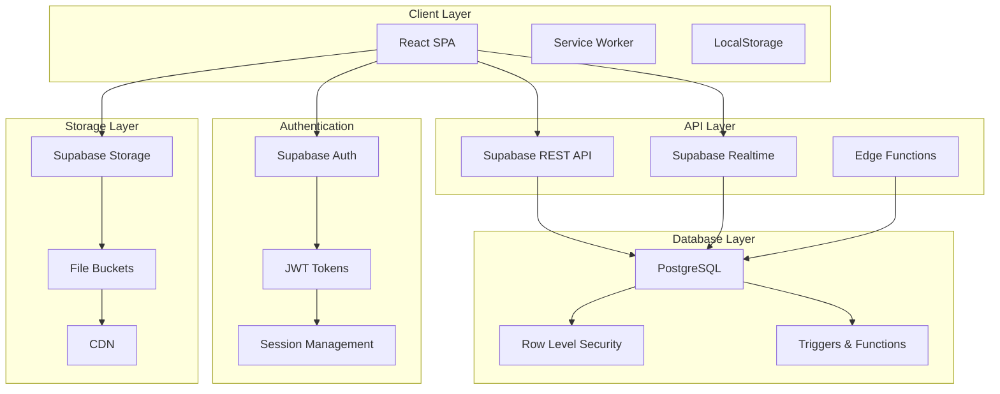

---

## 🎯 System Components

### 1. Frontend Application (React + Vite)

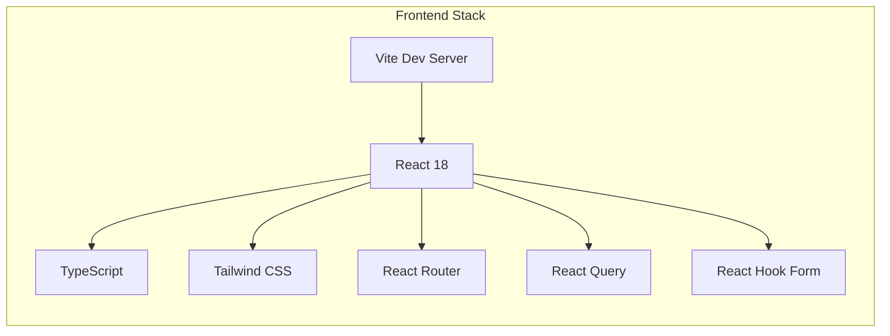

**Technologies**:
- **Build Tool**: Vite 5.4 - Fast HMR, optimized builds
- **UI Framework**: React 18 - Component-based architecture
- **Type Safety**: TypeScript 5.2 - Compile-time error checking
- **Styling**: Tailwind CSS 3.4 - Utility-first CSS
- **Routing**: React Router 6 - Client-side routing
- **State Management**: React Query - Server state management
- **Forms**: React Hook Form + Zod - Form validation

**Structure**:
```
src/
├── components/          # Reusable UI components
│   ├── ui/             # shadcn/ui components
│   ├── layout/         # Layout components (Sidebar, Header)
│   └── forms/          # Form components
├── pages/              # Route-based pages
├── hooks/              # Custom React hooks
├── lib/                # Configuration & setup
├── utils/              # Utility functions
├── types/              # TypeScript definitions
└── styles/             # Global CSS
```

---

### 2. Backend-as-a-Service (Supabase)

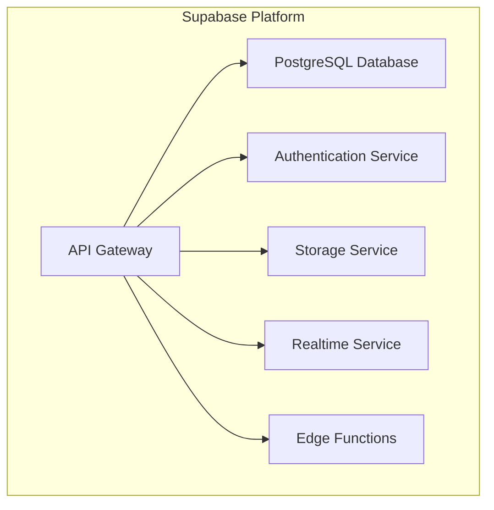

**Services**:

| Service | Purpose | Technology |
|---------|---------|------------|
| **PostgreSQL** | Primary database | PostgreSQL 15 |
| **Auth** | User authentication | GoTrue (JWT) |
| **Storage** | File storage | S3-compatible |
| **Realtime** | Live updates | WebSocket |
| **Edge Functions** | Serverless compute | Deno runtime |

**Configuration**:
```typescript
// Supabase client initialization
const supabase = createClient<Database>(
  process.env.VITE_SUPABASE_URL,
  process.env.VITE_SUPABASE_ANON_KEY,
  {
    auth: {
      autoRefreshToken: true,
      persistSession: true,
      detectSessionInUrl: true,
    },
    db: { schema: 'public' },
  }
)
```

---

### 3. Database Architecture

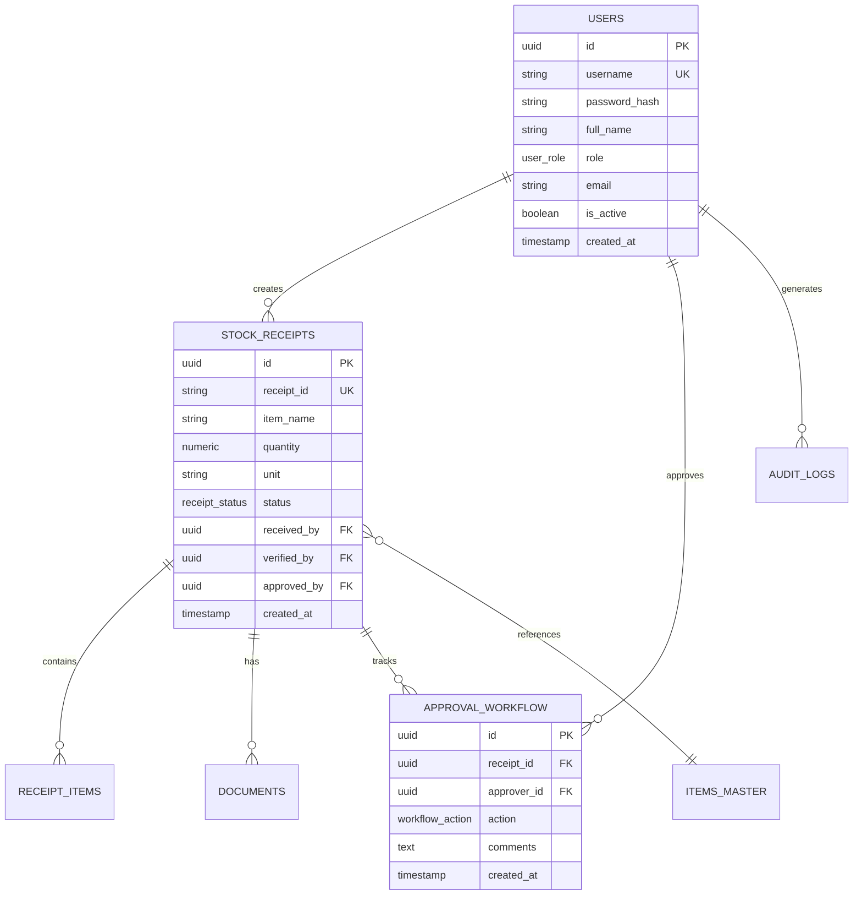

**Key Tables**:
1. **users** - User accounts and profiles
2. **stock_receipts** - Main receipt records
3. **receipt_items** - Line items in receipts
4. **items_master** - Item catalog
5. **documents** - Attached files
6. **approval_workflow** - Approval history
7. **audit_logs** - System activity logs

**Schema Features**:
- ✅ Row-Level Security (RLS) on all tables
- ✅ Triggers for audit logging
- ✅ Enums for type safety
- ✅ Foreign key constraints
- ✅ Indexes for performance

---

### 4. Authentication & Authorization Flow

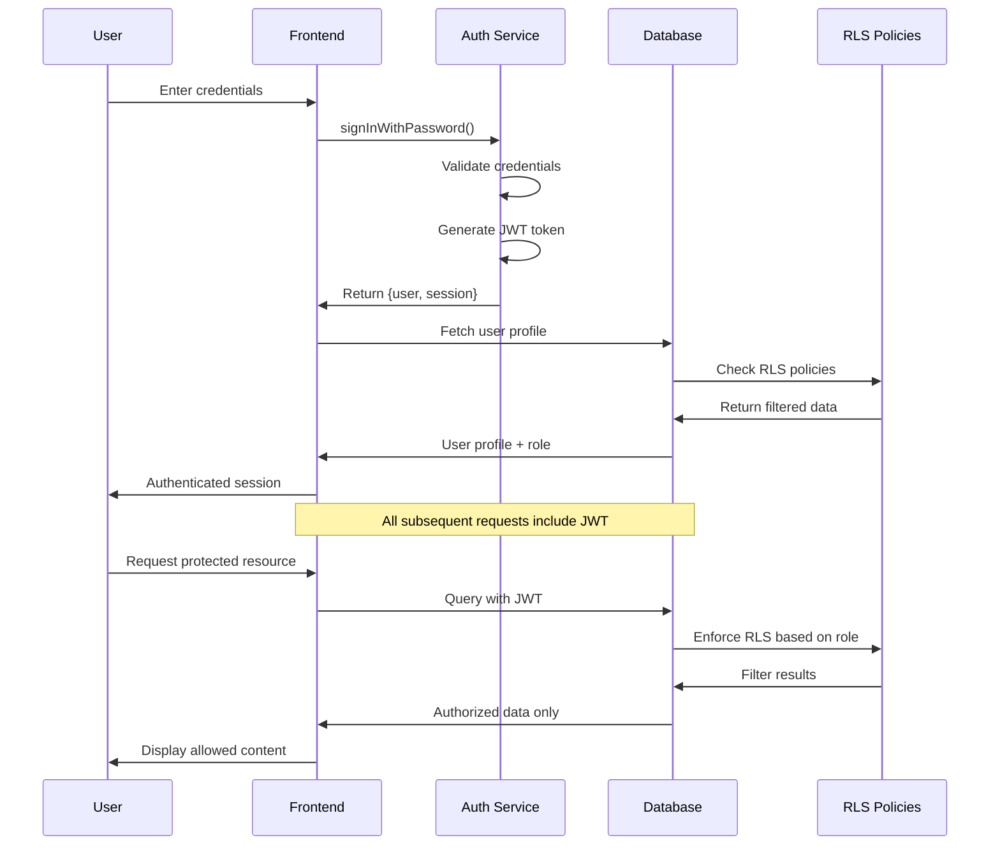

**Security Layers**:
1. **JWT Tokens**: Secure, stateless authentication
2. **Row-Level Security**: Database-level authorization
3. **Permission Checks**: Component-level access control
4. **Role-Based Routing**: Route-level protection

---

### 5. Data Flow Architecture

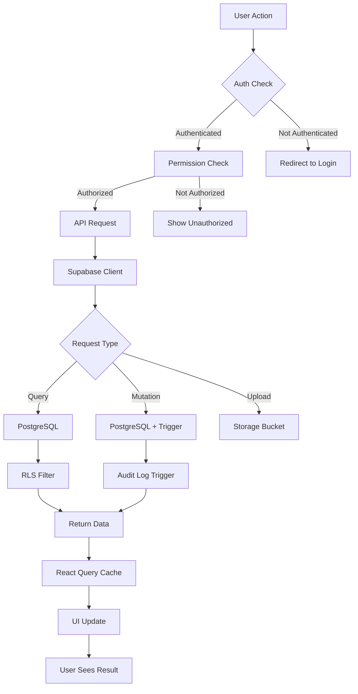

**Request Flow**:
1. User initiates action
2. Frontend validates permissions
3. API request sent with JWT
4. Supabase validates token
5. PostgreSQL enforces RLS
6. Data returned to client
7. React Query caches result
8. UI updates reactively

---

## 🔐 Security Architecture

### Defense in Depth Strategy

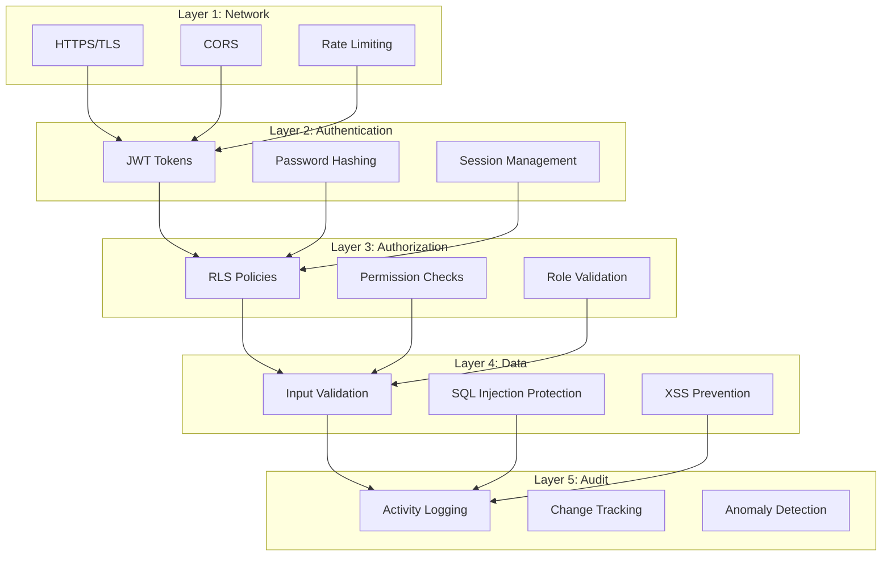

**Security Measures**:

| Layer | Implementation | Tool |
|-------|----------------|------|
| **Transport** | TLS 1.3 | Supabase |
| **Authentication** | JWT + bcrypt | Supabase Auth |
| **Authorization** | RLS + RBAC | PostgreSQL + Custom |
| **Input Validation** | Zod schemas | React Hook Form |
| **Output Encoding** | React escaping | React (automatic) |
| **Audit Logging** | Triggers | PostgreSQL |

---

## 📊 State Management Architecture

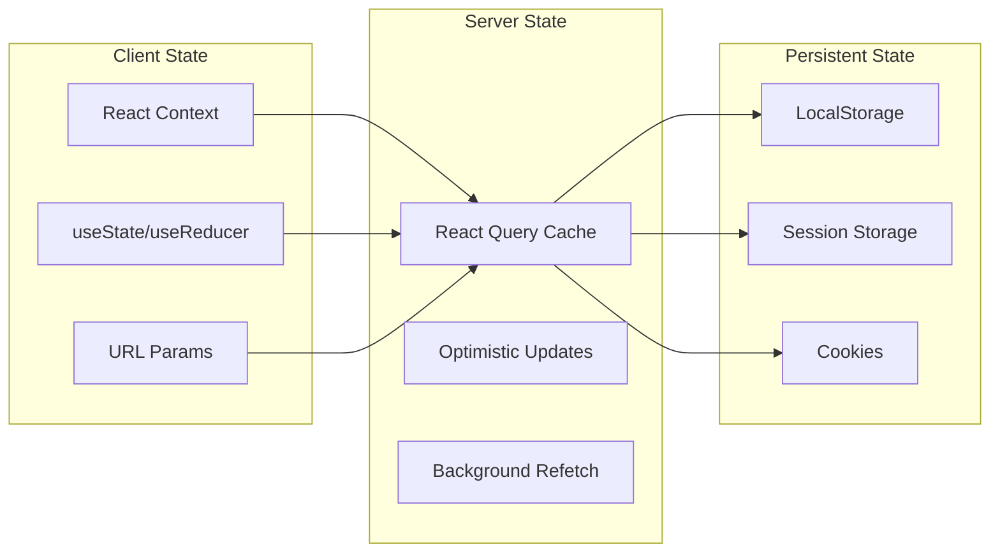

**State Categories**:

1. **Authentication State** (React Context)
   - User profile
   - Session info
   - Permissions

2. **Server State** (React Query)
   - Receipts list
   - User data
   - Audit logs

3. **UI State** (Local useState)
   - Modal open/closed
   - Form inputs
   - Sidebar collapsed

4. **URL State** (Search Params)
   - Filters
   - Pagination
   - Sort order

---

## 🚀 Deployment Architecture

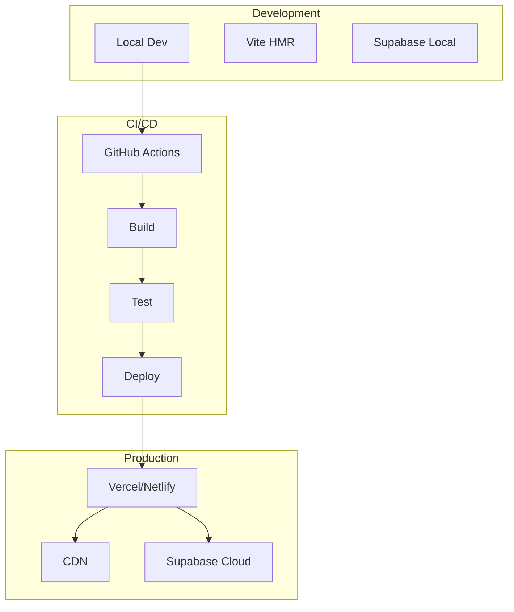

**Deployment Strategy**:

| Stage | Platform | Purpose |
|-------|----------|---------|
| **Development** | Local + Supabase | Development environment |
| **Staging** | Vercel Preview | Testing before production |
| **Production** | Vercel/Netlify | Live application |
| **Database** | Supabase Cloud | Managed PostgreSQL |
| **Storage** | Supabase Storage | File hosting |

---

## ⚡ Performance Architecture

### Optimization Strategies

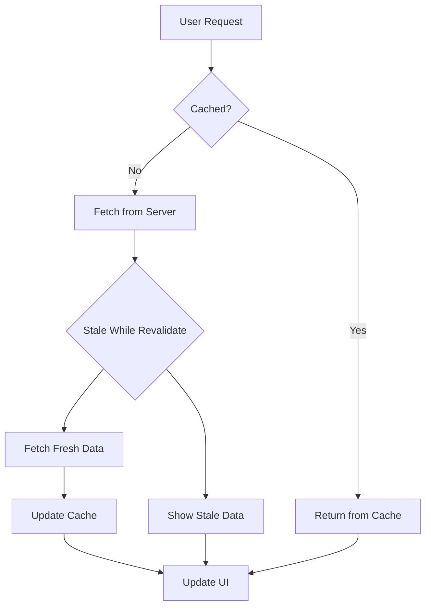

**Performance Features**:

1. **Code Splitting**: Route-based lazy loading
2. **Caching**: React Query with stale-while-revalidate
3. **Debouncing**: Search input, auto-save
4. **Pagination**: Server-side with page caching
5. **Image Optimization**: Lazy loading, WebP format
6. **Bundle Size**: Tree shaking, minification

**Metrics**:
- First Contentful Paint: < 1.5s
- Time to Interactive: < 3s
- Largest Contentful Paint: < 2.5s
- Cumulative Layout Shift: < 0.1

---

## 🔄 Real-Time Architecture

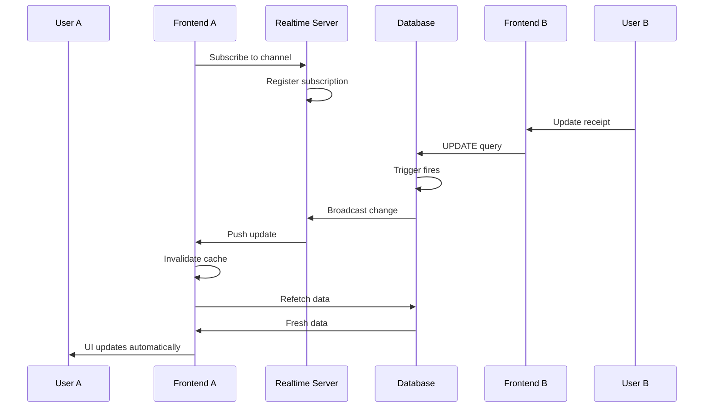

**Realtime Features**:
- Live receipt status updates
- Collaborative editing prevention
- Notification delivery
- Approval queue updates

---

## 📦 Module Architecture

```
Quarter Master Application
│
├── Core Modules
│   ├── Authentication
│   ├── Authorization
│   └── Routing
│
├── Feature Modules
│   ├── Receipts
│   │   ├── List
│   │   ├── Create
│   │   └── Detail
│   ├── Approvals
│   ├── Inventory
│   └── Users
│
├── Shared Modules
│   ├── UI Components
│   ├── Forms
│   └── Utils
│
└── Integration Modules
    ├── Supabase Client
    ├── Storage
    └── Analytics
```

---

## 🎯 Design Patterns

### 1. Component Patterns

```typescript
// Container/Presenter Pattern
const ReceiptsContainer = () => {
  const { data, isLoading } = useQuery(['receipts'], fetchReceipts)
  return <ReceiptsList data={data} isLoading={isLoading} />
}

// Compound Components
<Form>
  <Form.Input name="email" />
  <Form.Submit />
</Form>

// Render Props
<DataFetcher
  query={['user']}
  render={(data) => <UserProfile user={data} />}
/>
```

### 2. Hook Patterns

```typescript
// Custom Hook for Data Fetching
const useReceipts = (filters) => {
  return useQuery({
    queryKey: ['receipts', filters],
    queryFn: () => fetchReceipts(filters),
  })
}

// Custom Hook for Permissions
const usePermission = (permission) => {
  const { hasPermission } = useAuth()
  return hasPermission(permission)
}
```

### 3. State Management Patterns

```typescript
// Context Provider Pattern
<AuthProvider>
  <App />
</AuthProvider>

// Reducer Pattern
const [state, dispatch] = useReducer(reducer, initialState)
```

---

## 🔗 Integration Architecture

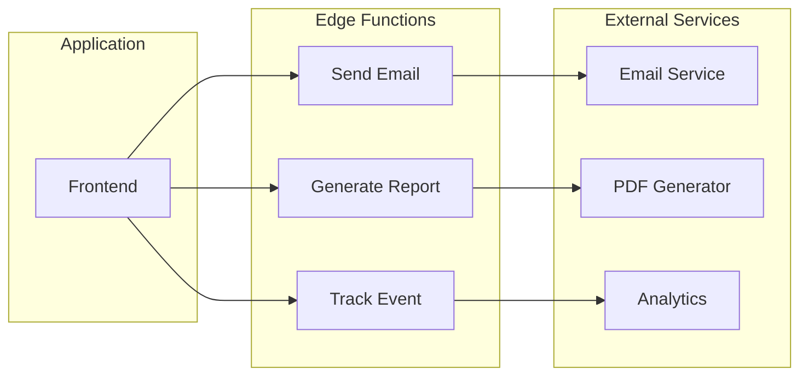

**Integration Points**:
- Email notifications (future)
- PDF generation (future)
- Analytics tracking (future)
- Export functionality

---

## 📊 Scalability Considerations

### Horizontal Scaling

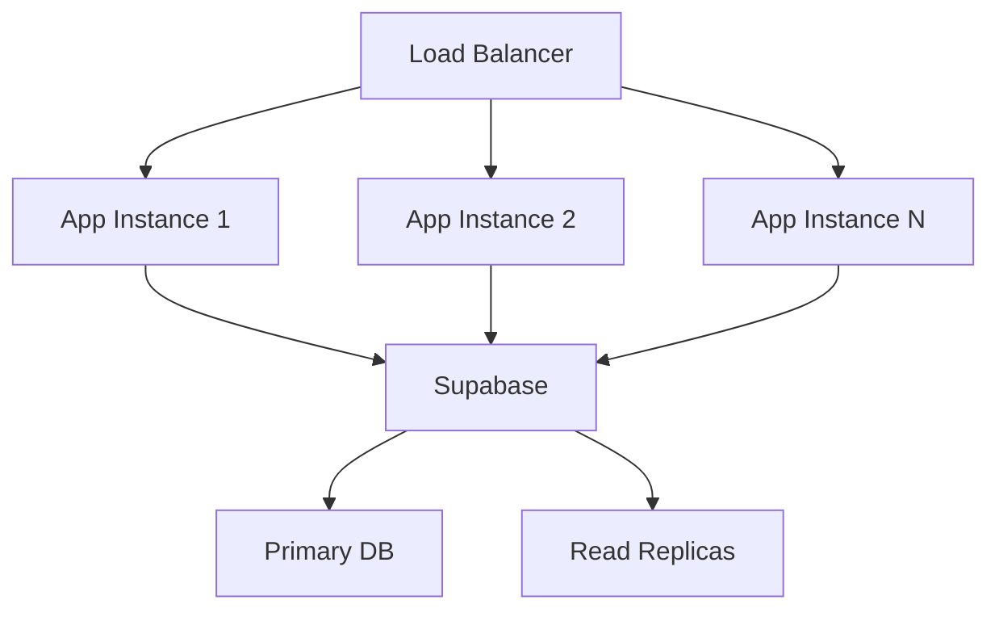

**Scaling Strategy**:
1. **Frontend**: CDN + multiple edge locations
2. **API**: Auto-scaling with Supabase
3. **Database**: Read replicas for queries
4. **Storage**: CDN for files

---

## 🔧 Development Workflow

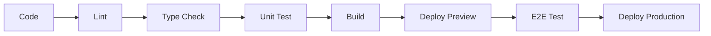

**Workflow Steps**:
1. Local development with HMR
2. Pre-commit hooks (Husky)
3. CI pipeline (GitHub Actions)
4. Automated testing
5. Preview deployment (Vercel)
6. Production deployment

---

## 📈 Monitoring & Observability

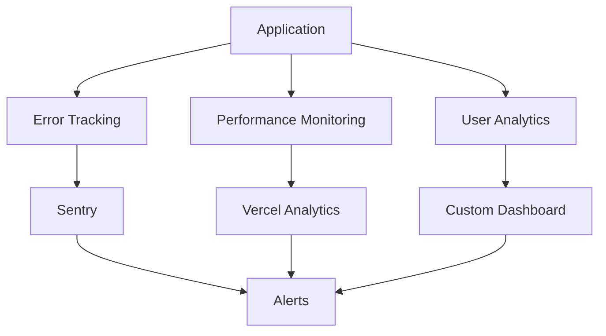

**Monitoring Tools** (Future):
- Error tracking: Sentry
- Performance: Vercel Analytics
- Database: Supabase Dashboard
- Logs: Supabase Logs

---

## 🎓 Technology Decision Matrix

| Requirement | Technology | Rationale |
|-------------|------------|-----------|
| **Fast Development** | Vite | < 100ms HMR |
| **Type Safety** | TypeScript | Compile-time checks |
| **Backend** | Supabase | BaaS, built-in auth/storage |
| **Database** | PostgreSQL | ACID compliance, RLS |
| **UI Framework** | React | Large ecosystem, stable |
| **Styling** | Tailwind | Rapid prototyping |
| **Forms** | React Hook Form | Performance, DX |
| **Data Fetching** | React Query | Caching, optimistic updates |
| **Validation** | Zod | Type-safe schemas |

---

## 🔗 Related Documentation

- [Database Schema](../database-schema.md)
- [Security Guidelines](../security.md)
- [Deployment Guide](../deployment-guide.md)
- [Performance Optimization](../performance/optimization.md)

---

**Last Updated**: 2025-10-04  
**Version**: 1.0.0  
**Maintainer**: Quarter Master Development Team
