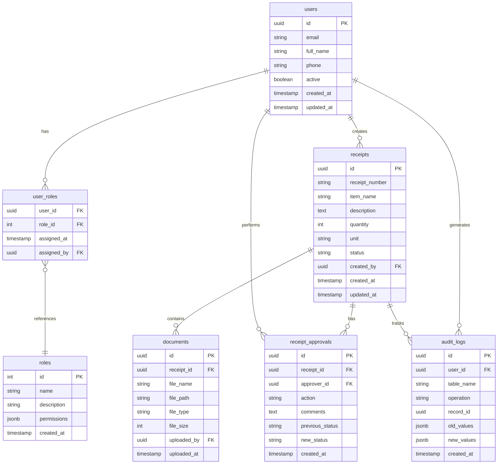

# 🗄️ Database Schema - Quarter Master Inventory

Complete PostgreSQL database schema with Supabase integration, Row Level Security (RLS), and audit triggers.

## 📊 Database Overview



## 🏗️ Table Definitions

### 1. users (Extended Supabase auth.users)

```sql
-- Users table (extends Supabase auth.users)
CREATE TABLE users (
    id UUID PRIMARY KEY REFERENCES auth.users(id) ON DELETE CASCADE,
    email VARCHAR(255) UNIQUE NOT NULL,
    full_name VARCHAR(255) NOT NULL,
    phone VARCHAR(20),
    department VARCHAR(100),
    active BOOLEAN DEFAULT true,
    created_at TIMESTAMP WITH TIME ZONE DEFAULT NOW(),
    updated_at TIMESTAMP WITH TIME ZONE DEFAULT NOW()
);

-- Indexes
CREATE INDEX idx_users_email ON users(email);
CREATE INDEX idx_users_active ON users(active);
CREATE INDEX idx_users_department ON users(department);

-- RLS Policies
ALTER TABLE users ENABLE ROW LEVEL SECURITY;

-- Users can read their own profile
CREATE POLICY "Users can view own profile" ON users
    FOR SELECT USING (auth.uid() = id);

-- Users can update their own profile
CREATE POLICY "Users can update own profile" ON users
    FOR UPDATE USING (auth.uid() = id);

-- Admins can view all users
CREATE POLICY "Admins can view all users" ON users
    FOR SELECT USING (
        EXISTS (
            SELECT 1 FROM user_roles ur
            JOIN roles r ON ur.role_id = r.id
            WHERE ur.user_id = auth.uid()
            AND r.name IN ('admin', 'super_admin')
        )
    );
```

### 2. roles

```sql
-- Roles table
CREATE TABLE roles (
    id SERIAL PRIMARY KEY,
    name VARCHAR(50) UNIQUE NOT NULL,
    description TEXT,
    permissions JSONB DEFAULT '{}',
    created_at TIMESTAMP WITH TIME ZONE DEFAULT NOW()
);

-- Insert default roles
INSERT INTO roles (name, description, permissions) VALUES
('semi_user', 'Can create and edit draft receipts', '{"create_receipt": true, "edit_own_draft": true}'),
('user', 'Can verify submitted receipts', '{"create_receipt": true, "edit_own_draft": true, "verify_receipt": true}'),
('admin', 'Can approve verified receipts and manage inventory', '{"create_receipt": true, "edit_own_draft": true, "verify_receipt": true, "approve_receipt": true, "view_reports": true}'),
('super_admin', 'Full system access including user management', '{"all": true}');

-- RLS Policies
ALTER TABLE roles ENABLE ROW LEVEL SECURITY;

-- All authenticated users can read roles
CREATE POLICY "Authenticated users can view roles" ON roles
    FOR SELECT USING (auth.role() = 'authenticated');
```

### 3. user_roles

```sql
-- User roles junction table
CREATE TABLE user_roles (
    user_id UUID REFERENCES users(id) ON DELETE CASCADE,
    role_id INTEGER REFERENCES roles(id) ON DELETE CASCADE,
    assigned_at TIMESTAMP WITH TIME ZONE DEFAULT NOW(),
    assigned_by UUID REFERENCES users(id),
    PRIMARY KEY (user_id, role_id)
);

-- Indexes
CREATE INDEX idx_user_roles_user_id ON user_roles(user_id);
CREATE INDEX idx_user_roles_role_id ON user_roles(role_id);

-- RLS Policies
ALTER TABLE user_roles ENABLE ROW LEVEL SECURITY;

-- Users can view their own roles
CREATE POLICY "Users can view own roles" ON user_roles
    FOR SELECT USING (auth.uid() = user_id);

-- Super admins can manage all user roles
CREATE POLICY "Super admins can manage user roles" ON user_roles
    FOR ALL USING (
        EXISTS (
            SELECT 1 FROM user_roles ur
            JOIN roles r ON ur.role_id = r.id
            WHERE ur.user_id = auth.uid()
            AND r.name = 'super_admin'
        )
    );
```

### 4. receipts

```sql
-- Stock receipts table
CREATE TABLE receipts (
    id UUID PRIMARY KEY DEFAULT gen_random_uuid(),
    receipt_number VARCHAR(50) UNIQUE NOT NULL,
    item_name VARCHAR(255) NOT NULL,
    description TEXT,
    quantity INTEGER NOT NULL CHECK (quantity > 0),
    unit VARCHAR(50) NOT NULL,
    unit_price DECIMAL(10,2),
    total_value DECIMAL(12,2) GENERATED ALWAYS AS (quantity * unit_price) STORED,
    supplier VARCHAR(255),
    purchase_date DATE,
    status VARCHAR(20) DEFAULT 'draft' CHECK (status IN ('draft', 'submitted', 'verified', 'approved', 'rejected')),
    created_by UUID REFERENCES users(id) NOT NULL,
    created_at TIMESTAMP WITH TIME ZONE DEFAULT NOW(),
    updated_at TIMESTAMP WITH TIME ZONE DEFAULT NOW()
);

-- Auto-generate receipt numbers
CREATE SEQUENCE receipt_number_seq START 1000;

CREATE OR REPLACE FUNCTION generate_receipt_number()
RETURNS TRIGGER AS $$
BEGIN
    IF NEW.receipt_number IS NULL THEN
        NEW.receipt_number := 'REC-' || TO_CHAR(NOW(), 'YYYY') || '-' || LPAD(nextval('receipt_number_seq')::TEXT, 6, '0');
    END IF;
    RETURN NEW;
END;
$$ LANGUAGE plpgsql;

CREATE TRIGGER trigger_generate_receipt_number
    BEFORE INSERT ON receipts
    FOR EACH ROW EXECUTE FUNCTION generate_receipt_number();

-- Indexes
CREATE INDEX idx_receipts_status ON receipts(status);
CREATE INDEX idx_receipts_created_by ON receipts(created_by);
CREATE INDEX idx_receipts_created_at ON receipts(created_at);
CREATE INDEX idx_receipts_receipt_number ON receipts(receipt_number);

-- RLS Policies
ALTER TABLE receipts ENABLE ROW LEVEL SECURITY;

-- Users can view receipts based on their role and status
CREATE POLICY "Users can view receipts based on role" ON receipts
    FOR SELECT USING (
        -- Can view own receipts
        created_by = auth.uid()
        OR
        -- Users can view submitted receipts for verification
        (status = 'submitted' AND EXISTS (
            SELECT 1 FROM user_roles ur
            JOIN roles r ON ur.role_id = r.id
            WHERE ur.user_id = auth.uid()
            AND r.name IN ('user', 'admin', 'super_admin')
        ))
        OR
        -- Admins can view verified receipts for approval
        (status = 'verified' AND EXISTS (
            SELECT 1 FROM user_roles ur
            JOIN roles r ON ur.role_id = r.id
            WHERE ur.user_id = auth.uid()
            AND r.name IN ('admin', 'super_admin')
        ))
        OR
        -- Admins and super admins can view all receipts
        EXISTS (
            SELECT 1 FROM user_roles ur
            JOIN roles r ON ur.role_id = r.id
            WHERE ur.user_id = auth.uid()
            AND r.name IN ('admin', 'super_admin')
        )
    );

-- Users can create receipts
CREATE POLICY "Users can create receipts" ON receipts
    FOR INSERT WITH CHECK (created_by = auth.uid());

-- Users can update their own draft receipts
CREATE POLICY "Users can update own draft receipts" ON receipts
    FOR UPDATE USING (
        created_by = auth.uid() AND status = 'draft'
    );
```

### 5. receipt_approvals

```sql
-- Receipt approval workflow table
CREATE TABLE receipt_approvals (
    id UUID PRIMARY KEY DEFAULT gen_random_uuid(),
    receipt_id UUID REFERENCES receipts(id) ON DELETE CASCADE NOT NULL,
    approver_id UUID REFERENCES users(id) NOT NULL,
    action VARCHAR(20) NOT NULL CHECK (action IN ('submit', 'verify', 'approve', 'reject', 'return')),
    comments TEXT,
    previous_status VARCHAR(20) NOT NULL,
    new_status VARCHAR(20) NOT NULL,
    created_at TIMESTAMP WITH TIME ZONE DEFAULT NOW()
);

-- Indexes
CREATE INDEX idx_receipt_approvals_receipt_id ON receipt_approvals(receipt_id);
CREATE INDEX idx_receipt_approvals_approver_id ON receipt_approvals(approver_id);
CREATE INDEX idx_receipt_approvals_created_at ON receipt_approvals(created_at);

-- RLS Policies
ALTER TABLE receipt_approvals ENABLE ROW LEVEL SECURITY;

-- Users can view approvals for receipts they can see
CREATE POLICY "Users can view receipt approvals" ON receipt_approvals
    FOR SELECT USING (
        EXISTS (
            SELECT 1 FROM receipts r
            WHERE r.id = receipt_id
            AND (
                r.created_by = auth.uid()
                OR EXISTS (
                    SELECT 1 FROM user_roles ur
                    JOIN roles ro ON ur.role_id = ro.id
                    WHERE ur.user_id = auth.uid()
                    AND ro.name IN ('admin', 'super_admin')
                )
            )
        )
    );

-- Users can create approvals
CREATE POLICY "Users can create approvals" ON receipt_approvals
    FOR INSERT WITH CHECK (approver_id = auth.uid());
```

### 6. documents

```sql
-- Documents table (linked to Supabase Storage)
CREATE TABLE documents (
    id UUID PRIMARY KEY DEFAULT gen_random_uuid(),
    receipt_id UUID REFERENCES receipts(id) ON DELETE CASCADE,
    file_name VARCHAR(255) NOT NULL,
    file_path VARCHAR(500) NOT NULL,
    file_type VARCHAR(100),
    file_size INTEGER,
    storage_bucket VARCHAR(100) DEFAULT 'receipt-documents',
    uploaded_by UUID REFERENCES users(id) NOT NULL,
    uploaded_at TIMESTAMP WITH TIME ZONE DEFAULT NOW()
);

-- Indexes
CREATE INDEX idx_documents_receipt_id ON documents(receipt_id);
CREATE INDEX idx_documents_uploaded_by ON documents(uploaded_by);

-- RLS Policies
ALTER TABLE documents ENABLE ROW LEVEL SECURITY;

-- Users can view documents for receipts they can access
CREATE POLICY "Users can view documents" ON documents
    FOR SELECT USING (
        EXISTS (
            SELECT 1 FROM receipts r
            WHERE r.id = receipt_id
            AND (
                r.created_by = auth.uid()
                OR EXISTS (
                    SELECT 1 FROM user_roles ur
                    JOIN roles ro ON ur.role_id = ro.id
                    WHERE ur.user_id = auth.uid()
                    AND ro.name IN ('user', 'admin', 'super_admin')
                )
            )
        )
    );

-- Users can upload documents for receipts they created
CREATE POLICY "Users can upload documents" ON documents
    FOR INSERT WITH CHECK (
        uploaded_by = auth.uid()
        AND EXISTS (
            SELECT 1 FROM receipts r
            WHERE r.id = receipt_id
            AND r.created_by = auth.uid()
        )
    );
```

### 7. audit_logs

```sql
-- Audit logs table
CREATE TABLE audit_logs (
    id UUID PRIMARY KEY DEFAULT gen_random_uuid(),
    user_id UUID REFERENCES users(id),
    table_name VARCHAR(50) NOT NULL,
    operation VARCHAR(10) NOT NULL CHECK (operation IN ('INSERT', 'UPDATE', 'DELETE')),
    record_id UUID NOT NULL,
    old_values JSONB,
    new_values JSONB,
    ip_address INET,
    user_agent TEXT,
    created_at TIMESTAMP WITH TIME ZONE DEFAULT NOW()
);

-- Indexes
CREATE INDEX idx_audit_logs_table_name ON audit_logs(table_name);
CREATE INDEX idx_audit_logs_user_id ON audit_logs(user_id);
CREATE INDEX idx_audit_logs_created_at ON audit_logs(created_at);
CREATE INDEX idx_audit_logs_record_id ON audit_logs(record_id);

-- RLS Policies
ALTER TABLE audit_logs ENABLE ROW LEVEL SECURITY;

-- Only admins and super admins can view audit logs
CREATE POLICY "Admins can view audit logs" ON audit_logs
    FOR SELECT USING (
        EXISTS (
            SELECT 1 FROM user_roles ur
            JOIN roles r ON ur.role_id = r.id
            WHERE ur.user_id = auth.uid()
            AND r.name IN ('admin', 'super_admin')
        )
    );
```

## 🔧 Database Functions

### 1. Audit Trigger Function

```sql
-- Audit trigger function
CREATE OR REPLACE FUNCTION audit_trigger_function()
RETURNS TRIGGER AS $$
BEGIN
    INSERT INTO audit_logs (
        user_id,
        table_name,
        operation,
        record_id,
        old_values,
        new_values,
        created_at
    ) VALUES (
        auth.uid(),
        TG_TABLE_NAME,
        TG_OP,
        CASE 
            WHEN TG_OP = 'DELETE' THEN OLD.id
            ELSE NEW.id
        END,
        CASE 
            WHEN TG_OP = 'DELETE' THEN to_jsonb(OLD)
            WHEN TG_OP = 'UPDATE' THEN to_jsonb(OLD)
            ELSE NULL
        END,
        CASE 
            WHEN TG_OP = 'DELETE' THEN NULL
            ELSE to_jsonb(NEW)
        END,
        NOW()
    );
    
    IF TG_OP = 'DELETE' THEN
        RETURN OLD;
    ELSE
        RETURN NEW;
    END IF;
END;
$$ LANGUAGE plpgsql;

-- Apply audit triggers to important tables
CREATE TRIGGER audit_receipts
    AFTER INSERT OR UPDATE OR DELETE ON receipts
    FOR EACH ROW EXECUTE FUNCTION audit_trigger_function();

CREATE TRIGGER audit_receipt_approvals
    AFTER INSERT OR UPDATE OR DELETE ON receipt_approvals
    FOR EACH ROW EXECUTE FUNCTION audit_trigger_function();

CREATE TRIGGER audit_users
    AFTER INSERT OR UPDATE OR DELETE ON users
    FOR EACH ROW EXECUTE FUNCTION audit_trigger_function();
```

### 2. Status Update Function

```sql
-- Function to update receipt status with approval
CREATE OR REPLACE FUNCTION update_receipt_status(
    receipt_uuid UUID,
    new_status VARCHAR(20),
    approval_comments TEXT DEFAULT NULL
) RETURNS BOOLEAN AS $$
DECLARE
    current_status VARCHAR(20);
    user_role VARCHAR(50);
BEGIN
    -- Get current status
    SELECT status INTO current_status FROM receipts WHERE id = receipt_uuid;
    
    -- Get user role
    SELECT r.name INTO user_role
    FROM user_roles ur
    JOIN roles r ON ur.role_id = r.id
    WHERE ur.user_id = auth.uid()
    LIMIT 1;
    
    -- Validate status transition
    IF NOT validate_status_transition(current_status, new_status, user_role) THEN
        RAISE EXCEPTION 'Invalid status transition from % to % for role %', current_status, new_status, user_role;
    END IF;
    
    -- Update receipt status
    UPDATE receipts SET 
        status = new_status,
        updated_at = NOW()
    WHERE id = receipt_uuid;
    
    -- Insert approval record
    INSERT INTO receipt_approvals (
        receipt_id,
        approver_id,
        action,
        comments,
        previous_status,
        new_status
    ) VALUES (
        receipt_uuid,
        auth.uid(),
        CASE 
            WHEN new_status = 'submitted' THEN 'submit'
            WHEN new_status = 'verified' THEN 'verify'
            WHEN new_status = 'approved' THEN 'approve'
            WHEN new_status = 'rejected' THEN 'reject'
            ELSE 'update'
        END,
        approval_comments,
        current_status,
        new_status
    );
    
    RETURN TRUE;
END;
$$ LANGUAGE plpgsql;
```

### 3. Status Validation Function

```sql
-- Function to validate status transitions
CREATE OR REPLACE FUNCTION validate_status_transition(
    current_status VARCHAR(20),
    new_status VARCHAR(20),
    user_role VARCHAR(50)
) RETURNS BOOLEAN AS $$
BEGIN
    -- Semi users can only submit drafts
    IF user_role = 'semi_user' THEN
        RETURN (current_status = 'draft' AND new_status = 'submitted');
    END IF;
    
    -- Users can verify submitted receipts
    IF user_role = 'user' THEN
        RETURN (
            (current_status = 'draft' AND new_status = 'submitted') OR
            (current_status = 'submitted' AND new_status IN ('verified', 'draft'))
        );
    END IF;
    
    -- Admins can approve verified receipts
    IF user_role IN ('admin', 'super_admin') THEN
        RETURN (
            (current_status = 'draft' AND new_status = 'submitted') OR
            (current_status = 'submitted' AND new_status IN ('verified', 'draft')) OR
            (current_status = 'verified' AND new_status IN ('approved', 'rejected', 'submitted'))
        );
    END IF;
    
    RETURN FALSE;
END;
$$ LANGUAGE plpgsql;
```

## 🔒 Security Features

### Row Level Security (RLS)
- **Enabled on all tables**: Ensures data access control at database level
- **Role-based policies**: Different access levels for each user role
- **Audit trail**: All changes tracked with user information

### Data Integrity
- **Foreign key constraints**: Maintain referential integrity
- **Check constraints**: Validate data values
- **Unique constraints**: Prevent duplicate records
- **Generated columns**: Automatic calculations

### Backup Strategy
```sql
-- Automated backups (to be configured in Supabase dashboard)
-- Point-in-time recovery available
-- Regular exports for compliance
```

## 📈 Performance Optimization

### Indexes
- **Primary keys**: Automatic B-tree indexes
- **Foreign keys**: Indexes on all foreign key columns
- **Query optimization**: Indexes on frequently filtered columns
- **Composite indexes**: For complex queries

### Partitioning (Future Enhancement)
```sql
-- Partition audit_logs by date for better performance
-- Partition receipts by year for large datasets
```

## 🔄 Migration Scripts

All database changes should be managed through Supabase migrations:

```bash
# Create new migration
supabase migration new create_initial_schema

# Apply migrations
supabase db push

# Reset database (development only)
supabase db reset
```

---

This schema provides a robust foundation for the Quarter Master Inventory Management System with proper security, audit trails, and performance optimization.
