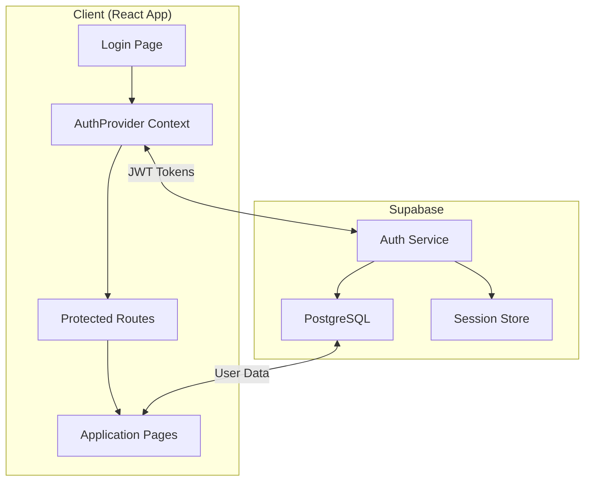
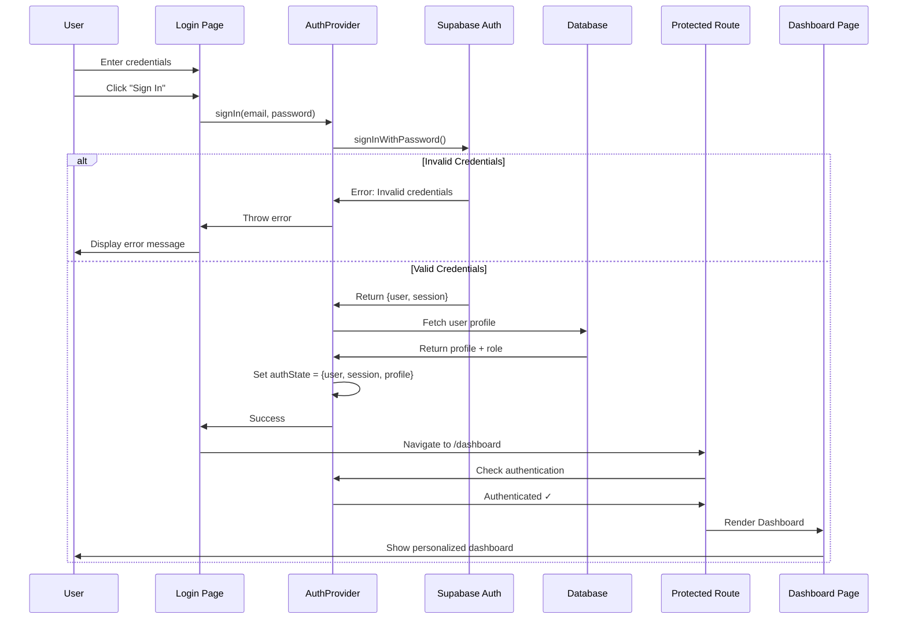
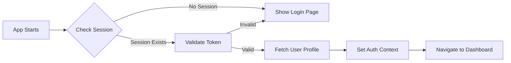
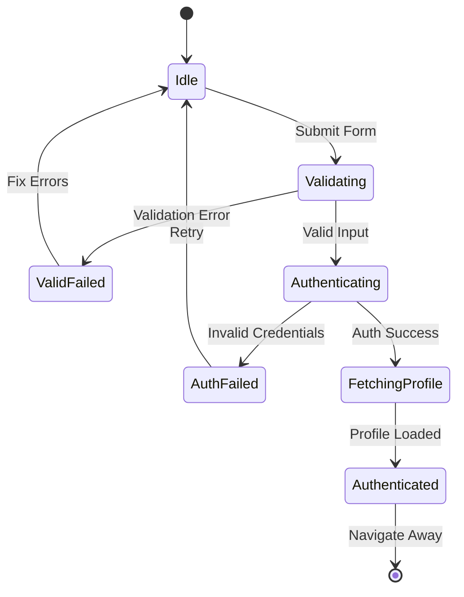
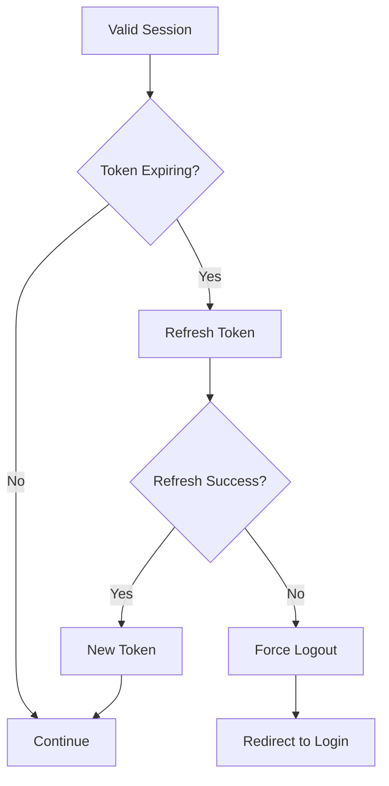
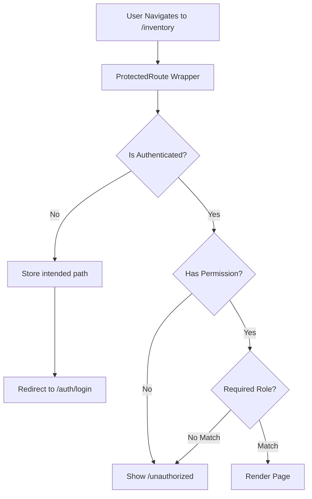
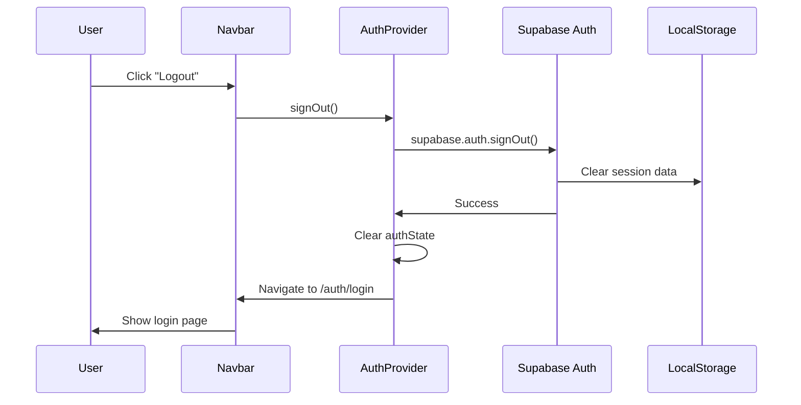

# Authentication Flow Documentation

## 🔐 Overview

This document describes the complete authentication flow in the Quarter Master system, from initial login through session management and logout.

---

## 🎯 Authentication Architecture



---

## 🔄 Complete Authentication Flow



---

## 📋 Detailed Flow Steps

### 1. Initial Page Load



**Code Implementation**:
```typescript
// AuthProvider initialization
useEffect(() => {
  const initializeAuth = async () => {
    const { data: { session } } = await supabase.auth.getSession()
    
    if (session) {
      // Fetch user profile
      const { data: profile } = await supabase
        .from('users')
        .select('*')
        .eq('id', session.user.id)
        .single()
      
      setUser(profile)
      setSession(session)
    }
    
    setInitializing(false)
  }
  
  initializeAuth()
}, [])
```

---

### 2. Login Process



**Step-by-Step**:

| Step | Action | Result |
|------|--------|--------|
| 1 | User enters email/password | Form state updated |
| 2 | User clicks "Sign In" | Trigger validation |
| 3 | Zod validates inputs | Pass/fail |
| 4 | Call `signIn(email, password)` | Auth Provider method |
| 5 | Supabase Auth validates | JWT token generated |
| 6 | Fetch user profile from DB | Profile data retrieved |
| 7 | Set auth context state | App state updated |
| 8 | Navigate to dashboard | User redirected |

---

### 3. Session Management



**Auto-Refresh Implementation**:
```typescript
// Supabase client config
const supabase = createClient(url, key, {
  auth: {
    autoRefreshToken: true,  // Auto-refresh before expiry
    persistSession: true,     // Persist in localStorage
    detectSessionInUrl: true, // Handle OAuth callbacks
  }
})

// Listen to auth state changes
supabase.auth.onAuthStateChange((event, session) => {
  if (event === 'SIGNED_IN') {
    // Update context
  } else if (event === 'SIGNED_OUT') {
    // Clear context
  } else if (event === 'TOKEN_REFRESHED') {
    // Update session
  }
})
```

---

### 4. Protected Route Check



**Implementation**:
```typescript
const ProtectedRoute: React.FC<ProtectedRouteProps> = ({
  children,
  requiredRoles,
  requiredPermission,
}) => {
  const { user, canAccess, initializing } = useAuth()
  
  if (initializing) return <LoadingSpinner />
  
  if (!user) {
    // Store intended destination
    return <Navigate to="/auth/login" state={{ from: location }} replace />
  }
  
  if (!canAccess(requiredRoles, requiredPermission)) {
    return <Navigate to="/unauthorized" replace />
  }
  
  return <>{children}</>
}
```

---

### 5. Logout Process



**Implementation**:
```typescript
const signOut = async () => {
  await supabase.auth.signOut()
  setUser(null)
  setSession(null)
  navigate('/auth/login')
}
```

---

## 🔐 Security Layers

### Layer 1: Client-Side Validation

```typescript
// Zod schema
const loginSchema = z.object({
  email: z.string().email('Valid email required'),
  password: z.string().min(6, 'Min 6 characters'),
})
```

**Purpose**: Prevent invalid data from being sent  
**Benefit**: Immediate user feedback, reduced server load

### Layer 2: Supabase Authentication

**Features**:
- Password hashing (bcrypt)
- Rate limiting
- Email verification
- JWT token generation

### Layer 3: Row-Level Security (RLS)

```sql
-- Example RLS policy
CREATE POLICY "Users can read own profile"
  ON users FOR SELECT
  USING (auth.uid() = id);
```

**Purpose**: Database-level access control  
**Benefit**: Even if tokens are compromised, data remains protected

### Layer 4: Permission Checks

```typescript
// Component-level
{hasPermission('create_receipt') && <CreateButton />}

// Route-level
<ProtectedRoute requiredPermission="view_reports">
  <InventoryPage />
</ProtectedRoute>
```

**Purpose**: Fine-grained feature access control  
**Benefit**: Role-specific UI and functionality

---

## 📊 Auth State Management

### Context Structure

```typescript
interface AuthContextType {
  // Core state
  user: User | null
  session: Session | null
  userProfile: UserProfile | null
  
  // Computed state
  roleName: UserRole | null
  isAuthenticated: boolean
  initializing: boolean
  loading: boolean
  
  // Actions
  signIn: (email: string, password: string) => Promise<void>
  signOut: () => Promise<void>
  
  // Helpers
  hasPermission: (permission: string) => boolean
  canAccess: (roles?: UserRole[], permission?: string) => boolean
}
```

### State Flow

```mermaid
graph LR
    A[Unauthenticated] -->|signIn()| B[Loading]
    B -->|Success| C[Authenticated]
    B -->|Error| A
    C -->|signOut()| A
    C -->|Token Refresh| C
    C -->|Token Expired| A
```

---

## 🚨 Error Handling

### Error Types

| Error Code | User Message | Action |
|------------|--------------|--------|
| `invalid_credentials` | Invalid email or password | Show error, allow retry |
| `email_not_confirmed` | Please verify your email | Show verification link |
| `user_banned` | Account suspended | Contact admin message |
| `network_error` | Connection failed | Show retry button |
| `token_expired` | Session expired | Auto-redirect to login |

### Error Recovery

```typescript
try {
  await signIn(email, password)
} catch (error) {
  if (error.message === 'Email not confirmed') {
    // Show resend verification option
  } else if (error.message === 'Invalid credentials') {
    // Show generic error (security)
  } else {
    // Show generic error with retry
  }
}
```

---

## 🧪 Testing Scenarios

### Test Cases

```typescript
describe('Authentication Flow', () => {
  it('should login successfully with valid credentials', async () => {
    // Test happy path
  })
  
  it('should reject invalid credentials', async () => {
    // Test auth failure
  })
  
  it('should redirect to intended page after login', async () => {
    // Test redirect flow
  })
  
  it('should auto-refresh expired tokens', async () => {
    // Test token refresh
  })
  
  it('should logout and clear session', async () => {
    // Test logout
  })
  
  it('should block access to protected routes when unauthenticated', async () => {
    // Test route protection
  })
})
```

---

## ⚡ Performance Considerations

### Optimization Strategies

1. **Session Persistence**: Store in localStorage to avoid re-login
2. **Token Caching**: Cache valid tokens to reduce auth calls
3. **Lazy Profile Loading**: Only fetch profile when needed
4. **Auth State Memoization**: Prevent unnecessary re-renders

```typescript
// Memoize auth checks
const canAccess = useMemo(() => {
  return (roles?: UserRole[], permission?: string) => {
    // Check logic
  }
}, [userProfile, roleName])
```

---

## 🔗 Related Documentation

- [Login Page](../pages/login-page.md)
- [Security Guidelines](../security.md)
- [Role-Based Access Control](../security/rbac.md)
- [Supabase Helpers](../utilities/supabase-helpers.md)

---

**Last Updated**: 2025-10-04  
**Version**: 1.0.0  
**Maintainer**: Quarter Master Development Team
