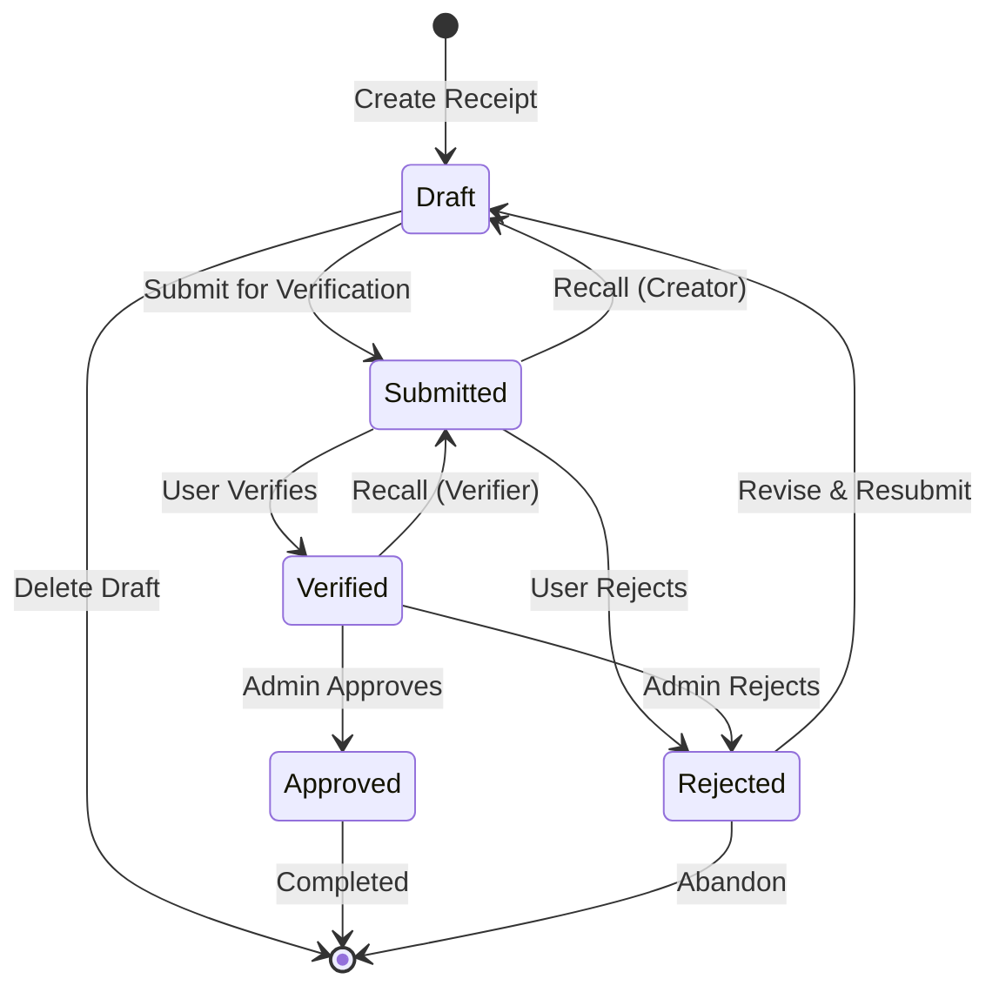
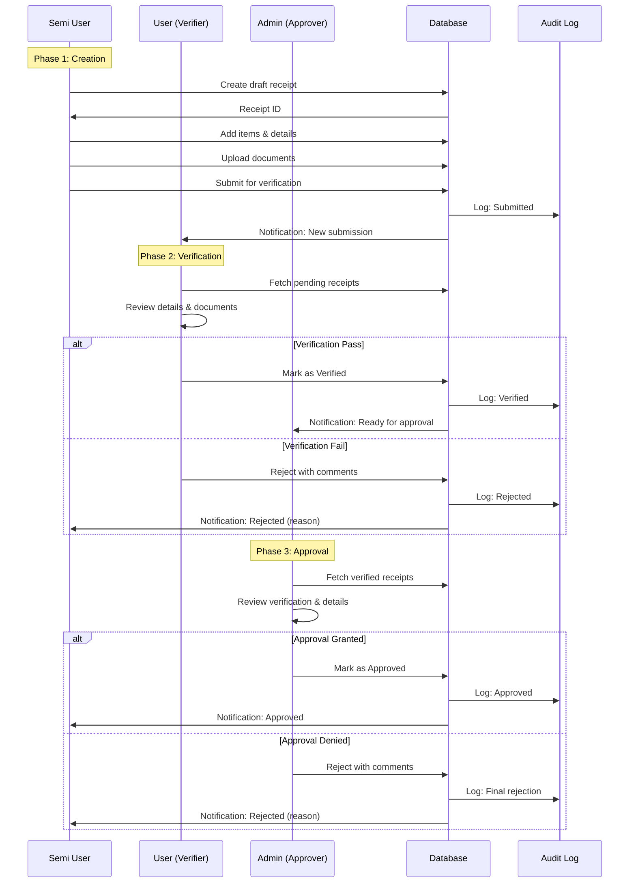
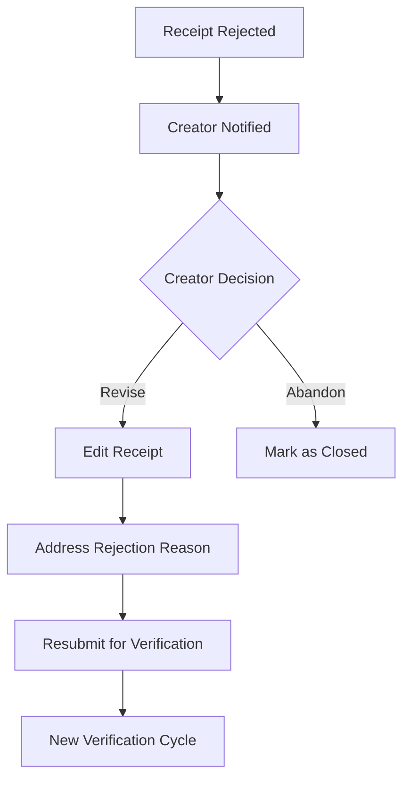

# Receipt Workflow Documentation

## 📦 Overview

This document describes the complete lifecycle of a stock receipt in the Quarter Master system, from creation through final approval or rejection.

---

## 🔄 Receipt Lifecycle States



---

## 📊 Receipt Status Matrix

| Status | Description | Who Can Edit | Next States | Actions Available |
|--------|-------------|--------------|-------------|-------------------|
| **Draft** | Initial creation, not submitted | Creator only | Submitted, Deleted | Edit, Submit, Delete |
| **Submitted** | Awaiting verification | No one (locked) | Verified, Rejected, Draft | Verify, Reject, Recall |
| **Verified** | Passed verification, awaiting approval | No one (locked) | Approved, Rejected, Submitted | Approve, Reject, Recall |
| **Approved** | Final approval granted | No one (archived) | None | View only, Export |

---

## 👥 Role-Based Actions

### Semi User (Requester)
```
┌─────────────────────────────┐
│ Can Do:                     │
│ - Create requisitions       │
│ - Edit own drafts           │
│ - Submit for approval       │
│ - View own requisitions     │
│ - Return issued items       │
│ - Receive approved items    │
└─────────────────────────────┘
```

### User (Watchman/Storekeeper)
```
┌─────────────────────────────┐
│ Can Do: (Watchman duties)   │
│ - Verify submitted receipts │
│ - Issue approved items only │
│ - Accept returns            │
│ - View approved requisitions│
└─────────────────────────────┘
```

### Admin (Approver)
```
┌─────────────────────────────┐
│ Can Do: (Approval authority)│
│ - Approve requisitions      │
│ - Reject requisitions       │
│ - Approve verified receipts │
│ - View all requisitions     │
│ - Export approved receipts  │
└─────────────────────────────┘
```

### Super Admin
```
┌─────────────────────────────┐
│ Can Do: (All Admin +)       │
│ - Override any status       │
│ - Delete any receipt        │
│ - View full audit trail     │
│ - Bulk operations           │
└─────────────────────────────┘
```

---

## 🎬 Complete Workflow Sequence



---

## 📝 Detailed Phase Breakdown

### Phase 1: Creation (Draft → Submitted)

**Actor**: Semi User / User

**Steps**:
1. Navigate to "Create Receipt"
2. Fill required fields:
   - Item name
   - Quantity
   - Unit
   - Description (optional)
   - Unit price (optional)
   - Supplier (optional)
   - Purchase date (optional)
3. Attach documents (receipts, invoices)
4. Save as draft (can edit later)
5. Submit for verification (locks editing)

**Validation Rules**:
```typescript
const receiptSchema = z.object({
  item_name: z.string().min(3, 'Min 3 characters'),
  quantity: z.number().positive('Must be positive'),
  unit: z.string().min(1, 'Unit required'),
  description: z.string().optional(),
  unit_price: z.number().positive().optional(),
  supplier: z.string().optional(),
  purchase_date: z.string().optional(),
})
```

**State Change**:
```sql
UPDATE stock_receipts
SET status = 'submitted',
    submitted_at = now(),
    submitted_by = current_user_id
WHERE id = receipt_id AND status = 'draft';
```

---

### Phase 2: Verification (Submitted → Verified/Rejected)

**Actor**: User (with `verify_receipt` permission)

**Verification Checklist**:
- [ ] Item details are accurate
- [ ] Quantity matches documentation
- [ ] Supporting documents are legible
- [ ] No duplicate entries
- [ ] Supplier information is valid
- [ ] Unit pricing is reasonable

**Actions**:

**Verify**:
```typescript
const verifyReceipt = async (receiptId: string, comments?: string) => {
  const { error } = await supabase
    .from('stock_receipts')
    .update({
      status: 'verified',
      verified_at: new Date().toISOString(),
      verified_by: currentUserId,
    })
    .eq('id', receiptId)
  
  // Create approval workflow entry
  await supabase.from('approval_workflow').insert({
    receipt_id: receiptId,
    approver_id: currentUserId,
    action: 'verified',
    comments,
  })
}
```

**Reject**:
```typescript
const rejectReceipt = async (receiptId: string, reason: string) => {
  const { error } = await supabase
    .from('stock_receipts')
    .update({
      status: 'rejected',
      rejection_reason: reason,
      rejected_at: new Date().toISOString(),
      rejected_by: currentUserId,
    })
    .eq('id', receiptId)
}
```

---

### Phase 3: Approval (Verified → Approved/Rejected)

**Actor**: Admin (with `approve_receipt` permission)

**Approval Criteria**:
- [ ] Verification confirmed
- [ ] Budget availability verified
- [ ] Policy compliance checked
- [ ] No red flags in audit trail

**Actions**:

**Approve**:
```typescript
const approveReceipt = async (receiptId: string, comments?: string) => {
  const { error } = await supabase
    .from('stock_receipts')
    .update({
      status: 'approved',
      approved_at: new Date().toISOString(),
      approved_by: currentUserId,
    })
    .eq('id', receiptId)
  
  // Finalize workflow
  await supabase.from('approval_workflow').insert({
    receipt_id: receiptId,
    approver_id: currentUserId,
    action: 'approved',
    comments,
  })
}
```

**Final Rejection**:
```typescript
const finalReject = async (receiptId: string, reason: string) => {
  const { error } = await supabase
    .from('stock_receipts')
    .update({
      status: 'rejected',
      rejection_reason: reason,
      rejected_at: new Date().toISOString(),
      rejected_by: currentUserId,
    })
    .eq('id', receiptId)
}
```

---

## 🔄 Special Workflows

### Recall Mechanism

**Submitted → Draft** (Creator recalls before verification):
```typescript
const recallReceipt = async (receiptId: string) => {
  // Only creator can recall their own submissions
  const { error } = await supabase
    .from('stock_receipts')
    .update({ status: 'draft' })
    .eq('id', receiptId)
    .eq('received_by', currentUserId)
    .eq('status', 'submitted')
}
```

**Verified → Submitted** (Verifier recalls if mistake found):
```typescript
const unverifyReceipt = async (receiptId: string) => {
  // Only verifier who verified can unverify
  const { error } = await supabase
    .from('stock_receipts')
    .update({ status: 'submitted', verified_at: null, verified_by: null })
    .eq('id', receiptId)
    .eq('verified_by', currentUserId)
}
```

### Revision After Rejection



**Implementation**:
```typescript
const reviseRejectedReceipt = async (receiptId: string, updates: Partial<Receipt>) => {
  // Change status back to draft
  await supabase
    .from('stock_receipts')
    .update({
      ...updates,
      status: 'draft',
      revised_at: new Date().toISOString(),
    })
    .eq('id', receiptId)
    .eq('status', 'rejected')
}
```

---

## 📧 Notification System

### Notification Triggers

| Event | Recipient | Message |
|-------|-----------|---------|
| Receipt Submitted | Verifiers | "New receipt submitted for verification" |
| Receipt Verified | Approvers | "Receipt verified, ready for approval" |
| Receipt Approved | Creator | "Your receipt has been approved" |
| Receipt Rejected | Creator | "Your receipt was rejected: [reason]" |
| Receipt Recalled | Verifier/Approver | "Receipt has been recalled by creator" |

### Implementation Example

```typescript
const sendNotification = async (
  userId: string,
  type: 'submission' | 'verification' | 'approval' | 'rejection',
  receiptId: string,
  message: string
) => {
  // Insert into notifications table (real-time subscription on client)
  await supabase.from('notifications').insert({
    user_id: userId,
    type,
    receipt_id: receiptId,
    message,
    read: false,
  })
  
  // Optionally send email (via Supabase Edge Function)
  await supabase.functions.invoke('send-email', {
    body: { to: userEmail, subject: '...', body: message }
  })
}
```

---

## 🔐 Security & Permissions

### Permission Matrix

```typescript
const workflowPermissions = {
  draft: {
    view: ['creator', 'admin', 'super_admin'],
    edit: ['creator'],
    delete: ['creator', 'super_admin'],
    submit: ['creator'],
  },
  submitted: {
    view: ['creator', 'verifier', 'admin', 'super_admin'],
    verify: ['verifier', 'admin', 'super_admin'],
    reject: ['verifier', 'admin', 'super_admin'],
    recall: ['creator'],
  },
  verified: {
    view: ['all'],
    approve: ['admin', 'super_admin'],
    reject: ['admin', 'super_admin'],
    recall: ['verifier', 'admin', 'super_admin'],
  },
  approved: {
    view: ['all'],
    edit: [],
    delete: ['super_admin'],
  },
  rejected: {
    view: ['creator', 'admin', 'super_admin'],
    revise: ['creator'],
    delete: ['creator', 'super_admin'],
  },
}
```

### Row-Level Security (RLS) Policies

```sql
-- View policy: Users can see receipts based on status and role
CREATE POLICY "receipt_view_policy" ON stock_receipts
FOR SELECT USING (
  CASE
    WHEN status = 'draft' THEN received_by = auth.uid()
    WHEN status IN ('submitted', 'verified') THEN 
      auth.uid() IN (
        SELECT id FROM users 
        WHERE role IN ('user', 'admin', 'super_admin')
      )
    WHEN status IN ('approved', 'rejected') THEN true
  END
);

-- Update policy: Only specific roles can update based on status
CREATE POLICY "receipt_update_policy" ON stock_receipts
FOR UPDATE USING (
  CASE
    WHEN status = 'draft' THEN received_by = auth.uid()
    WHEN status = 'submitted' THEN 
      auth.uid() IN (
        SELECT id FROM users 
        WHERE role IN ('user', 'admin', 'super_admin')
      )
    WHEN status = 'verified' THEN 
      auth.uid() IN (
        SELECT id FROM users 
        WHERE role IN ('admin', 'super_admin')
      )
    ELSE false
  END
);
```

---

## 📊 Workflow Metrics

### Key Performance Indicators

```typescript
interface WorkflowMetrics {
  averageTimeToVerification: number     // Hours
  averageTimeToApproval: number        // Hours
  totalThroughputTime: number          // Days
  rejectionRate: number                // Percentage
  revisionRate: number                 // Percentage
  bottleneckStage: 'verification' | 'approval'
}
```

### Sample Query

```sql
SELECT 
  AVG(EXTRACT(EPOCH FROM (verified_at - submitted_at)) / 3600) AS avg_verification_hours,
  AVG(EXTRACT(EPOCH FROM (approved_at - verified_at)) / 3600) AS avg_approval_hours,
  COUNT(CASE WHEN status = 'rejected' THEN 1 END)::float / COUNT(*) * 100 AS rejection_rate
FROM stock_receipts
WHERE created_at >= NOW() - INTERVAL '30 days';
```

---

## 🧪 Testing Scenarios

### Happy Path Test

```typescript
test('Complete workflow from draft to approved', async () => {
  // 1. Create draft
  const receipt = await createReceipt({ item_name: 'Test Item', quantity: 10 })
  expect(receipt.status).toBe('draft')
  
  // 2. Submit
  await submitReceipt(receipt.id)
  expect(receipt.status).toBe('submitted')
  
  // 3. Verify
  await verifyReceipt(receipt.id, verifierUser)
  expect(receipt.status).toBe('verified')
  
  // 4. Approve
  await approveReceipt(receipt.id, adminUser)
  expect(receipt.status).toBe('approved')
})
```

### Rejection & Revision Test

```typescript
test('Receipt rejected and revised', async () => {
  const receipt = await createAndSubmitReceipt()
  
  // Reject with reason
  await rejectReceipt(receipt.id, 'Incomplete documents')
  expect(receipt.status).toBe('rejected')
  expect(receipt.rejection_reason).toBe('Incomplete documents')
  
  // Revise
  await reviseReceipt(receipt.id, { documents: ['new-doc.pdf'] })
  expect(receipt.status).toBe('draft')
  
  // Resubmit
  await submitReceipt(receipt.id)
  expect(receipt.status).toBe('submitted')
})
```

---

## 🚀 Performance Optimization

### Query Optimization

```sql
-- Index for filtering by status and user
CREATE INDEX idx_receipts_status_user ON stock_receipts(status, received_by);

-- Index for workflow queries
CREATE INDEX idx_receipts_workflow ON stock_receipts(status, submitted_at, verified_at);
```

### Caching Strategy

```typescript
// Cache pending approvals count
const { data: pendingCount, error } = await supabase
  .from('stock_receipts')
  .select('*', { count: 'exact', head: true })
  .eq('status', 'verified')

// Invalidate cache on status change
useQuery({
  queryKey: ['pendingApprovals'],
  queryFn: fetchPendingApprovals,
  staleTime: 30000, // 30 seconds
})
```

---

## 🔗 Related Documentation

- [Receipt Detail Page](../pages/receipt-detail-page.md)
- [Create Receipt Page](../pages/create-receipt-page.md)
- [Approvals Page](../pages/approvals-page.md)
- [Role-Based Access Control](../security/rbac.md)
- [Database Schema](../database-schema.md)

---

**Last Updated**: 2025-10-04  
**Version**: 1.0.0  
**Maintainer**: Quarter Master Development Team
