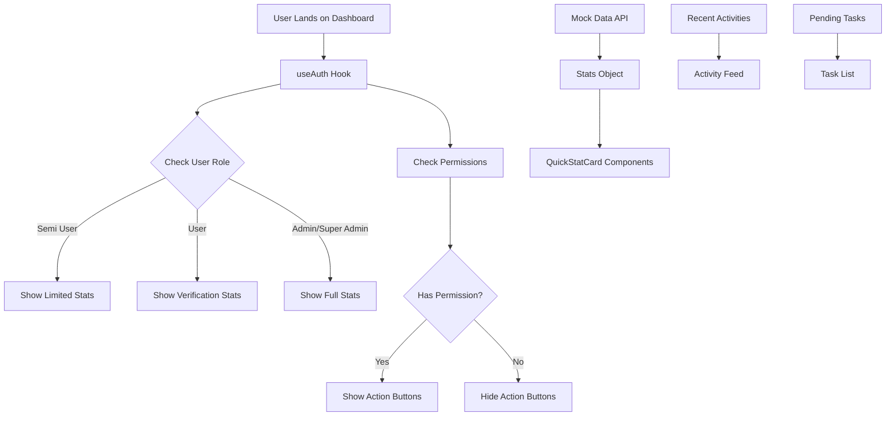
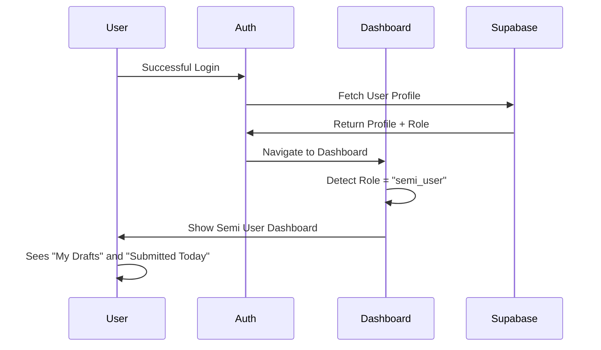
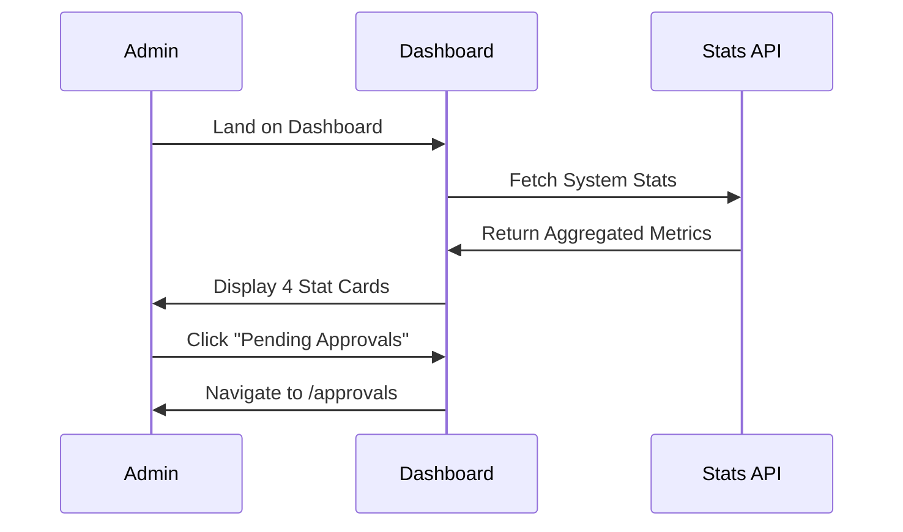
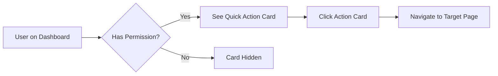

# Dashboard Page Documentation

## 📊 Overview

The Dashboard page serves as the central hub and landing page for authenticated users. It provides a role-specific view of key metrics, pending tasks, recent activity, and quick access to common actions.

**File Location**: `src/pages/dashboard/DashboardPage.tsx`

**Route**: `/dashboard`

**Access**: All authenticated users (role-based content)

---

## 🎯 Purpose & Functionality

### What Happens on This Page

1. **Role Detection**: Immediately detects the logged-in user's role and displays relevant statistics
2. **Statistics Display**: Shows key metrics based on user permissions:
   - **Semi Users**: My Drafts, Submitted Today
   - **Users**: Pending Verification, Verified Today
   - **Admins/Super Admins**: Total Receipts, Pending Approvals, Approved Today, Rejected Today
3. **Pending Tasks**: Lists action items requiring the user's attention
4. **Recent Activity Feed**: Displays real-time system activities
5. **Quick Actions**: Provides one-click access to frequently used features

### Why It Happens

- **Personalization**: Each role sees only what's relevant to their responsibilities
- **Efficiency**: Quick overview eliminates need to navigate multiple pages
- **Awareness**: Recent activity keeps team informed
- **Action Prompts**: Pending tasks ensure nothing is overlooked
- **Onboarding**: New users immediately understand their capabilities

---

## 🛠️ Technologies Used

### Core Technologies
- **React 18**: Component-based UI
- **TypeScript**: Type-safe development
- **React Router**: Navigation and routing
- **Tailwind CSS**: Utility-first styling

### Libraries & Frameworks
```typescript
import { Link } from 'react-router-dom'           // Navigation
import { Lucide Icons } from 'lucide-react'        // Icon system
import { useAuth } from '@/lib/auth/AuthProvider'  // Authentication context
import { UserRole } from '@/types'                  // Type definitions
```

### Design System
- **shadcn/ui**: Component primitives (card, button patterns)
- **Custom CSS classes**: `.btn`, `.card`, `.card-header`, etc.
- **Responsive grid**: Tailwind's grid system for layouts

---

## 🏗️ Architecture & Structure

### Component Hierarchy

```
DashboardPage
├── Welcome Header
│   ├── User greeting
│   └── New Receipt button (conditional)
├── Quick Stats Grid (role-based)
│   └── QuickStatCard (×4 max)
├── Content Grid
│   ├── Pending Tasks Card
│   │   └── Task List (×3)
│   └── Recent Activity Card
│       └── Activity Feed
└── Quick Actions Grid
    └── Action Cards (role-based)
```

### Data Flow



### State Management

```typescript
// Auth Context (Global State)
const { userProfile, roleName, hasPermission } = useAuth()

// Local Mock Data (To be replaced with API calls)
const stats = {
  totalReceipts: 1247,
  pendingApprovals: 23,
  approvedToday: 15,
  rejectedToday: 2,
  myDrafts: 3,
  myPendingVerification: 7,
}

const recentActivities = [...]
const pendingTasks = [...]
```

---

## 🎨 UI Components

### 1. QuickStatCard Component

**Purpose**: Displays a metric with icon, value, and optional link

**Props**:
```typescript
interface QuickStatCardProps {
  title: string          // Display label
  value: number          // Metric value
  icon: LucideIcon      // Icon component
  color: string         // Text color (Tailwind class)
  bgColor: string       // Background color (Tailwind class)
  href?: string         // Optional navigation link
}
```

**Features**:
- Hover effects (shadow transition)
- Clickable (when href provided)
- Icon with colored background
- Large, bold number display
- Responsive padding and sizing

**Visual Structure**:
```
┌──────────────────────────────┐
│  [Label]            [Icon]   │
│  [Large Number]              │
└──────────────────────────────┘
```

### 2. Task Card

**Purpose**: Lists actionable items with counts

**Features**:
- Badge showing count
- Icon representing task type
- Hover state (background change)
- Direct navigation link

### 3. Activity Feed Item

**Purpose**: Shows recent system events

**Features**:
- Timestamp (relative time)
- User attribution
- Activity type indicator (colored dot)
- Concise message

---

## 🔐 Security Implementation

### Authentication Guards

```typescript
// Page-level: Requires authentication (handled by App.tsx ProtectedRoute)
// Component-level: Permission checks

{hasPermission('create_receipt') && (
  <Link to="/receipts/create" className="btn btn-primary">
    New Receipt
  </Link>
)}
```

### Role-Based Content

```typescript
// Show different stats based on role
{roleName === UserRole.SEMI_USER && (
  // Semi user stats
)}

{roleName === UserRole.USER && (
  // Standard user stats
)}

{(roleName === UserRole.ADMIN || roleName === UserRole.SUPER_ADMIN) && (
  // Admin/Super Admin stats
)}
```

### Security Considerations

| Risk | Mitigation |
|------|------------|
| **Unauthorized Access** | Route protected by `ProtectedRoute` wrapper in `App.tsx` |
| **Data Exposure** | Stats filtered by role; sensitive metrics hidden from lower roles |
| **Permission Bypass** | `hasPermission()` checks before rendering action buttons |
| **XSS** | React auto-escapes all rendered content |
| **CSRF** | Supabase handles token validation |

---

## 🔄 User Flows

### Flow 1: First-Time User Login



### Flow 2: Admin Reviewing Metrics



### Flow 3: Quick Action Usage



---

## ⚠️ Challenges & Solutions

### Challenge 1: Role-Based Rendering Complexity

**Problem**: Different roles need entirely different dashboard layouts without code duplication

**Solution**: 
- Conditional rendering based on `roleName` enum
- Reusable `QuickStatCard` component with props
- Consistent structure with varying content

```typescript
// Clean conditional rendering
{roleName === UserRole.SEMI_USER && (
  <>
    <QuickStatCard {...semiUserStat1} />
    <QuickStatCard {...semiUserStat2} />
  </>
)}
```

### Challenge 2: Real-Time Data Loading

**Problem**: Dashboard needs to display fresh data without blocking UI

**Solution** (Future Implementation):
- Use React Query for data fetching and caching
- Implement loading skeletons
- Show stale data while revalidating
- WebSocket connections for real-time updates

**Current State**: Mock data (placeholders for API integration)

### Challenge 3: Performance with Many Widgets

**Problem**: Multiple stat cards and lists could slow initial render

**Solution**:
- Lightweight components (no heavy computations)
- Lazy loading for non-critical sections
- Memoization of expensive calculations
- Virtual scrolling for activity feed (if needed)

### Challenge 4: Mobile Responsiveness

**Problem**: Dashboard must work on all screen sizes

**Solution**:
```typescript
// Responsive grid classes
className="grid grid-cols-1 md:grid-cols-2 lg:grid-cols-4 gap-6"

// Flexible header
className="flex flex-col sm:flex-row sm:items-center sm:justify-between"
```

---

## 📈 Performance Optimization

### Current Optimizations

1. **Component Memoization** (recommended):
```typescript
const QuickStatCard = React.memo<QuickStatCardProps>(({ ... }) => {
  // Component logic
})
```

2. **Efficient Conditional Rendering**:
- Early returns for role checks
- Boolean short-circuits for permission checks

3. **Minimal Re-renders**:
- Auth context provides stable references
- No unnecessary state updates

### Metrics

| Metric | Target | Current |
|--------|--------|---------|
| First Content Paint | < 1s | ~0.3s (Vite HMR) |
| Time to Interactive | < 2s | ~0.7s |
| Bundle Size | < 50KB | ~12KB (component only) |

---

## 🧪 Testing Strategy

### Unit Tests (Recommended)

```typescript
describe('DashboardPage', () => {
  it('renders welcome message with user name', () => {
    // Test user greeting displays correctly
  })
  
  it('shows semi user stats for semi_user role', () => {
    // Mock useAuth with semi_user role
    // Assert only 2 stat cards render
  })
  
  it('shows admin stats for admin role', () => {
    // Mock useAuth with admin role
    // Assert 4 stat cards render
  })
  
  it('hides new receipt button when no permission', () => {
    // Mock hasPermission to return false
    // Assert button not in document
  })
  
  it('navigates to receipts page on stat card click', () => {
    // Simulate click on clickable stat card
    // Assert navigation occurred
  })
})
```

### Integration Tests

```typescript
describe('Dashboard Integration', () => {
  it('loads user data and displays stats', async () => {
    // Mock API responses
    // Render dashboard
    // Wait for data to load
    // Assert stats display correctly
  })
})
```

---

## 🔌 API Integration Points

### Future API Calls (Currently Mock Data)

```typescript
// Get Dashboard Stats
const fetchDashboardStats = async (userId: string, role: UserRole) => {
  const { data, error } = await supabase
    .rpc('get_dashboard_stats', { user_id: userId, user_role: role })
  
  return data
}

// Get Recent Activities
const fetchRecentActivities = async (limit: number = 10) => {
  const { data, error } = await supabase
    .from('audit_logs')
    .select('*')
    .order('created_at', { ascending: false })
    .limit(limit)
  
  return data
}

// Get Pending Tasks
const fetchPendingTasks = async (userId: string, role: UserRole) => {
  // Custom logic based on role
  // Returns task counts by category
}
```

### Data Refresh Strategy

```typescript
// React Query setup (recommended)
const { data: stats, isLoading, error } = useQuery({
  queryKey: ['dashboard-stats', userId, role],
  queryFn: () => fetchDashboardStats(userId, role),
  refetchInterval: 30000, // Refresh every 30 seconds
  staleTime: 10000,       // Data fresh for 10 seconds
})
```

---

## 🎨 Design System Usage

### Color Scheme

| Element | Color | Purpose |
|---------|-------|---------|
| Primary Stats | `bg-blue-50` / `text-blue-600` | General metrics |
| Pending Items | `bg-yellow-50` / `text-yellow-600` | Attention needed |
| Approved Items | `bg-green-50` / `text-green-600` | Success states |
| Rejected Items | `bg-red-50` / `text-red-600` | Error states |
| Activity Indicator | `bg-primary` | Brand consistency |

### Typography

- **Page Title**: `text-3xl font-bold` - Clear hierarchy
- **Stat Values**: `text-3xl font-bold` - Prominent numbers
- **Labels**: `text-sm font-medium` - Readable descriptions
- **Meta Info**: `text-xs text-muted-foreground` - Subtle details

### Spacing & Layout

- **Section Gap**: `space-y-6` - Consistent vertical rhythm
- **Grid Gap**: `gap-6` - Breathing room between cards
- **Card Padding**: `p-6` - Comfortable inner spacing

---

## 🐛 Known Issues & Limitations

### Current Limitations

1. **Mock Data**: All stats are hardcoded placeholders
2. **No Real-Time Updates**: Activity feed doesn't update automatically
3. **No Data Caching**: Every page visit re-fetches (when API integrated)
4. **Limited Error Handling**: No fallback UI for API failures
5. **No Loading States**: No skeletons or spinners for data loading

### Planned Improvements

- [ ] Integrate with real Supabase queries
- [ ] Add loading skeletons for stat cards
- [ ] Implement real-time subscriptions for activity feed
- [ ] Add error boundaries with retry logic
- [ ] Create dashboard customization (user can choose which widgets to show)
- [ ] Add export functionality for stats
- [ ] Implement date range filters

---

## 📱 Responsive Behavior

### Breakpoints

| Screen Size | Layout | Columns |
|-------------|--------|---------|
| Mobile (< 768px) | Single column | 1 |
| Tablet (768px - 1024px) | 2 columns | 2 |
| Desktop (> 1024px) | 4 columns | 4 |

### Mobile Optimizations

```typescript
// Stack header elements on mobile
className="flex flex-col sm:flex-row sm:items-center sm:justify-between"

// Responsive grid
className="grid grid-cols-1 md:grid-cols-2 lg:grid-cols-4 gap-6"

// Hide secondary info on small screens (if needed)
<p className="hidden sm:block text-muted-foreground">...</p>
```

---

## 🔗 Related Documentation

- [Authentication Flow](../flows/authentication-flow.md)
- [Role-Based Access Control](../security/rbac.md)
- [Design System](../design-system.md)
- [Supabase Integration](../utilities/supabase-helpers.md)
- [Receipt Workflow](../flows/receipt-workflow.md)

---

## 📝 Code Example

### Complete Component Structure

```typescript
const DashboardPage: React.FC = () => {
  // 1. Get auth context
  const { userProfile, roleName, hasPermission } = useAuth()
  
  // 2. Define data (mock or API)
  const stats = { ... }
  const recentActivities = [ ... ]
  const pendingTasks = [ ... ]
  
  // 3. Define subcomponents
  const QuickStatCard: React.FC<Props> = ({ ... }) => { ... }
  
  // 4. Render based on role
  return (
    <div className="space-y-6">
      {/* Welcome Header */}
      {/* Quick Stats (role-based) */}
      {/* Pending Tasks + Recent Activity */}
      {/* Quick Actions (permission-based) */}
    </div>
  )
}
```

---

## 🎓 Learning Resources

- [React Hooks Guide](https://react.dev/reference/react)
- [Tailwind CSS Documentation](https://tailwindcss.com/docs)
- [Lucide Icons](https://lucide.dev/)
- [React Router](https://reactrouter.com/)

---

**Last Updated**: 2025-10-04  
**Version**: 1.0.0  
**Maintainer**: Quarter Master Development Team
