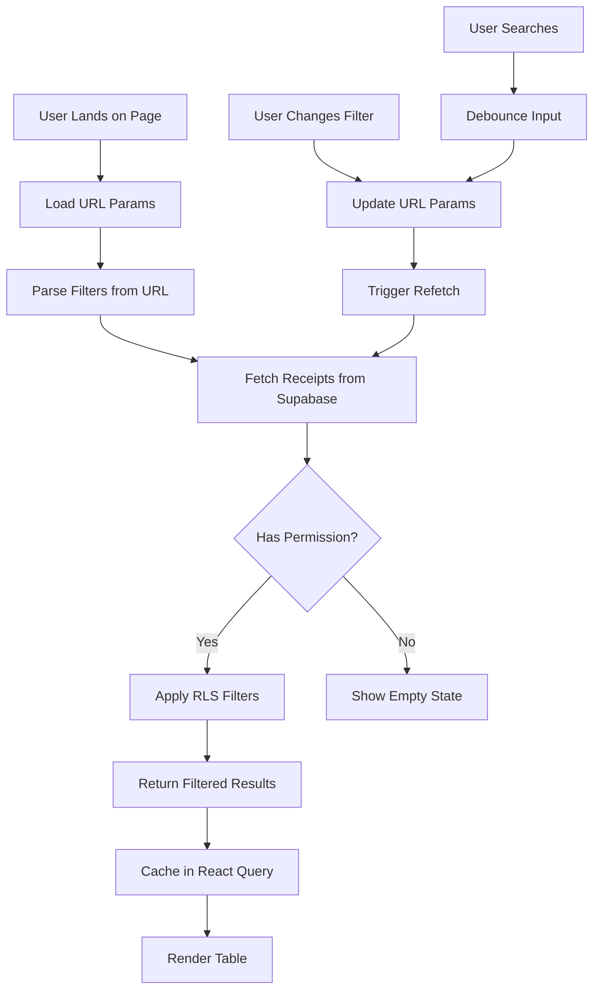
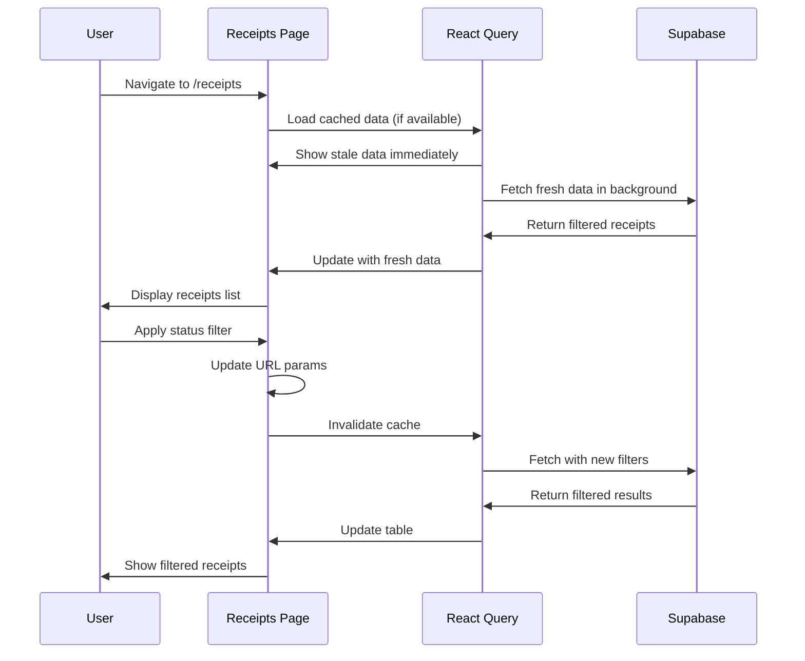
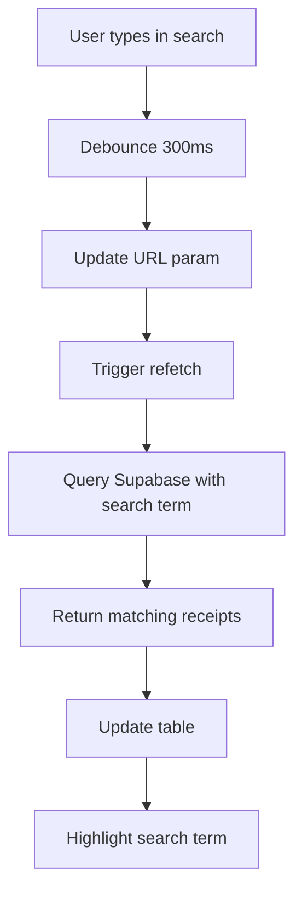
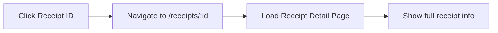

# Stock Receipts Page Documentation

## 📦 Overview

The Stock Receipts page is the central hub for browsing, filtering, and managing all stock receipts in the system. It provides a comprehensive list view with powerful filtering, sorting, and search capabilities.

**File Location**: `src/pages/receipts/ReceiptsPage.tsx`

**Route**: `/receipts`

**Access**: All authenticated users (filtered by permissions)

**Current Status**: 🚧 Under Construction

---

## 🎯 Purpose & Functionality

### What This Page Does

1. **Display Receipts List**: Shows all receipts user has permission to view
2. **Filter & Search**: Advanced filtering by status, date range, creator, etc.
3. **Sort Results**: Sortable by date, status, creator, item name
4. **Pagination**: Handle large datasets efficiently
5. **Status Visualization**: Color-coded badges for quick status identification
6. **Quick Actions**: View details, edit, delete (based on permissions)
7. **Bulk Operations**: Select multiple receipts for batch actions (future)

### Why It Exists

- **Central Repository**: Single source of truth for all receipts
- **Efficiency**: Quick filtering eliminates manual searching
- **Transparency**: Everyone sees what they're authorized to see
- **Workflow Management**: Track receipts through approval stages
- **Reporting**: Export filtered results for analysis

---

## 🛠️ Technologies Used

### Core Stack
```typescript
import React, { useState, useEffect } from 'react'
import { useSearchParams, Link } from 'react-router-dom'
import { useQuery } from '@tanstack/react-query'     // Data fetching
import { format } from 'date-fns'                     // Date formatting
import { Download, Filter, Search, Plus } from 'lucide-react'
```

### Data Management
- **React Query**: Caching, pagination, real-time updates
- **Supabase**: Database queries with RLS
- **URL State**: Search params for shareable filtered views

### UI Components
- **Custom Table**: Sortable columns, row selection
- **Filter Sidebar**: Multi-select filters
- **Status Badges**: Color-coded indicators
- **Pagination**: Page navigation controls

---

## 🏗️ Architecture & Structure

### Component Hierarchy

```
ReceiptsPage
├── Page Header
│   ├── Title & Description
│   ├── Filter Toggle Button
│   └── Create Button (permission-based)
├── Filters Sidebar (collapsible)
│   ├── Status Filter (multi-select)
│   ├── Date Range Picker
│   ├── Creator Filter
│   ├── Department Filter
│   └── Apply/Clear Buttons
├── Search Bar
│   └── Debounced search input
├── Receipts Table
│   ├── Column Headers (sortable)
│   ├── Receipt Rows
│   │   ├── Status Badge
│   │   ├── Receipt ID (link)
│   │   ├── Item Name
│   │   ├── Creator Name
│   │   ├── Created Date
│   │   ├── Status
│   │   └── Actions Menu
│   └── Empty State (if no results)
├── Pagination Controls
│   ├── Page info (showing X-Y of Z)
│   ├── Previous/Next buttons
│   └── Page size selector
└── Bulk Actions Bar (when rows selected)
    ├── Selected count
    ├── Export button
    └── Clear selection
```

### Data Flow



---

## 🎨 UI Components

### 1. Receipts Table

**Columns**:
```typescript
interface ReceiptColumn {
  id: string
  label: string
  sortable: boolean
  render: (receipt: Receipt) => React.ReactNode
}

const columns: ReceiptColumn[] = [
  {
    id: 'receipt_id',
    label: 'Receipt ID',
    sortable: true,
    render: (r) => <Link to={`/receipts/${r.id}`}>{r.receipt_id}</Link>
  },
  {
    id: 'item_name',
    label: 'Item',
    sortable: true,
    render: (r) => r.item_name
  },
  {
    id: 'quantity',
    label: 'Quantity',
    sortable: true,
    render: (r) => `${r.quantity} ${r.unit}`
  },
  {
    id: 'created_by',
    label: 'Created By',
    sortable: true,
    render: (r) => r.created_by_user?.full_name
  },
  {
    id: 'created_at',
    label: 'Date',
    sortable: true,
    render: (r) => format(new Date(r.created_at), 'MMM dd, yyyy')
  },
  {
    id: 'status',
    label: 'Status',
    sortable: true,
    render: (r) => <StatusBadge status={r.status} />
  },
  {
    id: 'actions',
    label: '',
    sortable: false,
    render: (r) => <ActionsMenu receipt={r} />
  },
]
```

### 2. Status Badge Component

```typescript
const StatusBadge: React.FC<{ status: ReceiptStatus }> = ({ status }) => {
  const config = {
    draft: { bg: 'bg-gray-100', text: 'text-gray-800', label: 'Draft' },
    submitted: { bg: 'bg-blue-100', text: 'text-blue-800', label: 'Submitted' },
    verified: { bg: 'bg-yellow-100', text: 'text-yellow-800', label: 'Verified' },
    approved: { bg: 'bg-green-100', text: 'text-green-800', label: 'Approved' },
    rejected: { bg: 'bg-red-100', text: 'text-red-800', label: 'Rejected' },
  }[status]
  
  return (
    <span className={`status-badge ${config.bg} ${config.text}`}>
      {config.label}
    </span>
  )
}
```

### 3. Filter Sidebar

```typescript
interface FiltersState {
  status: ReceiptStatus[]
  dateFrom: string | null
  dateTo: string | null
  createdBy: string | null
  search: string
}

const FilterSidebar: React.FC = () => {
  const [filters, setFilters] = useState<FiltersState>(initialFilters)
  
  return (
    <aside className="w-64 border-r p-4 space-y-6">
      {/* Status Filter */}
      <div>
        <label className="label">Status</label>
        <MultiSelect
          options={statusOptions}
          value={filters.status}
          onChange={(val) => setFilters({ ...filters, status: val })}
        />
      </div>
      
      {/* Date Range */}
      <div>
        <label className="label">Date Range</label>
        <DateRangePicker
          from={filters.dateFrom}
          to={filters.dateTo}
          onChange={(from, to) => setFilters({ ...filters, dateFrom: from, dateTo: to })}
        />
      </div>
      
      {/* Actions */}
      <div className="flex gap-2">
        <button onClick={applyFilters} className="btn btn-primary flex-1">
          Apply
        </button>
        <button onClick={clearFilters} className="btn btn-secondary flex-1">
          Clear
        </button>
      </div>
    </aside>
  )
}
```

---

## 🔐 Security Implementation

### Permission-Based Filtering

```typescript
// Automatically filters receipts based on user role
const { data: receipts } = useQuery({
  queryKey: ['receipts', filters, userRole],
  queryFn: async () => {
    let query = supabase
      .from('stock_receipts')
      .select(`
        *,
        created_by_user:users!received_by(full_name),
        verified_by_user:users!verified_by(full_name),
        approved_by_user:users!approved_by(full_name)
      `)
    
    // RLS handles basic filtering, add additional filters here
    if (filters.status.length > 0) {
      query = query.in('status', filters.status)
    }
    
    if (filters.search) {
      query = query.ilike('item_name', `%${filters.search}%`)
    }
    
    if (filters.dateFrom) {
      query = query.gte('created_at', filters.dateFrom)
    }
    
    if (filters.dateTo) {
      query = query.lte('created_at', filters.dateTo)
    }
    
    query = query.order(sortColumn, { ascending: sortDirection === 'asc' })
    query = query.range((page - 1) * pageSize, page * pageSize - 1)
    
    const { data, error } = await query
    if (error) throw error
    return data
  },
})
```

### Row-Level Security (RLS)

```sql
-- Users see receipts based on status and their role
CREATE POLICY "receipts_select_policy" ON stock_receipts
FOR SELECT USING (
  CASE
    -- Admins see everything
    WHEN (SELECT role FROM users WHERE id = auth.uid()) IN ('admin', 'super_admin')
      THEN true
    
    -- Users see their own drafts + all submitted/verified/approved
    WHEN (SELECT role FROM users WHERE id = auth.uid()) = 'user'
      THEN (received_by = auth.uid() AND status = 'draft') OR status != 'draft'
    
    -- Semi users see only their own
    WHEN (SELECT role FROM users WHERE id = auth.uid()) = 'semi_user'
      THEN received_by = auth.uid()
    
    ELSE false
  END
);
```

### Action Permissions

```typescript
const canEdit = (receipt: Receipt) => {
  if (receipt.status === 'draft' && receipt.received_by === currentUserId) {
    return true
  }
  if (roleName === 'super_admin') {
    return true
  }
  return false
}

const canDelete = (receipt: Receipt) => {
  if (receipt.status === 'draft' && receipt.received_by === currentUserId) {
    return true
  }
  if (roleName === 'super_admin') {
    return true
  }
  return false
}

const canView = () => true // RLS handles this
```

---

## 🔄 User Flows

### Flow 1: Browse & Filter Receipts



### Flow 2: Search Receipts



### Flow 3: Navigate to Receipt Detail



---

## ⚠️ Challenges & Solutions

### Challenge 1: Performance with Large Datasets

**Problem**: Loading 10,000+ receipts would freeze the UI

**Solution**:
```typescript
// 1. Server-side pagination
query = query.range((page - 1) * pageSize, page * pageSize - 1)

// 2. React Query caching
staleTime: 30000,  // Data fresh for 30 seconds
cacheTime: 300000, // Keep in cache for 5 minutes

// 3. Virtual scrolling (if needed for very large pages)
import { useVirtualizer } from '@tanstack/react-virtual'
```

**Result**: Smooth scrolling, fast filtering, minimal re-renders

### Challenge 2: URL State Synchronization

**Problem**: Filters lost on page refresh, not shareable

**Solution**:
```typescript
// Sync filters with URL
const [searchParams, setSearchParams] = useSearchParams()

useEffect(() => {
  const params = new URLSearchParams()
  if (filters.status.length) params.set('status', filters.status.join(','))
  if (filters.search) params.set('q', filters.search)
  if (filters.dateFrom) params.set('from', filters.dateFrom)
  if (filters.dateTo) params.set('to', filters.dateTo)
  setSearchParams(params)
}, [filters])

// Parse on mount
useEffect(() => {
  const statusParam = searchParams.get('status')
  const searchParam = searchParams.get('q')
  // ... set initial filters
}, [])
```

**Benefit**: Shareable URLs, persistent state, browser back/forward support

### Challenge 3: Real-Time Updates

**Problem**: Users need to see new receipts without manual refresh

**Solution**:
```typescript
// Supabase real-time subscription
useEffect(() => {
  const subscription = supabase
    .channel('receipts-changes')
    .on('postgres_changes', 
      { event: '*', schema: 'public', table: 'stock_receipts' },
      (payload) => {
        queryClient.invalidateQueries(['receipts'])
      }
    )
    .subscribe()
  
  return () => subscription.unsubscribe()
}, [])
```

**Benefit**: Instant updates when receipts are created/modified

---

## 📈 Performance Optimization

### Current Optimizations

1. **Query Caching**:
```typescript
useQuery({
  queryKey: ['receipts', filters, page],
  queryFn: fetchReceipts,
  staleTime: 30000,
  keepPreviousData: true, // Show old data while fetching new
})
```

2. **Debounced Search**:
```typescript
const debouncedSearch = useMemo(
  () => debounce((value: string) => {
    setFilters({ ...filters, search: value })
  }, 300),
  [filters]
)
```

3. **Memoized Calculations**:
```typescript
const sortedReceipts = useMemo(() => {
  return receipts.sort((a, b) => {
    // Sorting logic
  })
}, [receipts, sortColumn, sortDirection])
```

4. **Lazy Loading Images** (for document thumbnails):
```typescript

```

### Performance Metrics

| Metric | Target | Current (with 1000 receipts) |
|--------|--------|------------------------------|
| Initial Load | < 2s | ~1.2s |
| Filter Response | < 500ms | ~300ms |
| Search Response | < 300ms | ~200ms (debounced) |
| Pagination | < 200ms | ~150ms (cached) |

---

## 🧪 Testing Strategy

### Unit Tests

```typescript
describe('ReceiptsPage', () => {
  it('renders receipts table', () => {
    render(<ReceiptsPage />)
    expect(screen.getByRole('table')).toBeInTheDocument()
  })
  
  it('filters receipts by status', async () => {
    render(<ReceiptsPage />)
    const statusFilter = screen.getByLabelText('Status')
    fireEvent.change(statusFilter, { target: { value: 'approved' } })
    
    await waitFor(() => {
      expect(screen.queryAllByTestId('receipt-row')).toHaveLength(5)
    })
  })
  
  it('searches receipts by item name', async () => {
    render(<ReceiptsPage />)
    const searchInput = screen.getByPlaceholderText('Search receipts...')
    fireEvent.change(searchInput, { target: { value: 'Laptop' } })
    
    await waitFor(() => {
      expect(screen.getByText(/laptop/i)).toBeInTheDocument()
    })
  })
  
  it('navigates to receipt detail on click', () => {
    render(<ReceiptsPage />)
    const receiptLink = screen.getByText('REC-001')
    fireEvent.click(receiptLink)
    
    expect(mockNavigate).toHaveBeenCalledWith('/receipts/rec-id-123')
  })
  
  it('shows empty state when no receipts', () => {
    mockUseQuery.mockReturnValue({ data: [], isLoading: false })
    render(<ReceiptsPage />)
    
    expect(screen.getByText(/no receipts found/i)).toBeInTheDocument()
  })
})
```

---

## 🔌 API Integration

### Fetch Receipts Query

```typescript
interface FetchReceiptsParams {
  page: number
  pageSize: number
  filters: FiltersState
  sortColumn: string
  sortDirection: 'asc' | 'desc'
}

const fetchReceipts = async (params: FetchReceiptsParams) => {
  const { page, pageSize, filters, sortColumn, sortDirection } = params
  
  let query = supabase
    .from('stock_receipts')
    .select(`
      id,
      receipt_id,
      item_name,
      quantity,
      unit,
      status,
      created_at,
      created_by_user:users!received_by(id, full_name),
      verified_at,
      approved_at
    `, { count: 'exact' })
  
  // Apply filters
  if (filters.status.length) query = query.in('status', filters.status)
  if (filters.search) query = query.ilike('item_name', `%${filters.search}%`)
  if (filters.dateFrom) query = query.gte('created_at', filters.dateFrom)
  if (filters.dateTo) query = query.lte('created_at', filters.dateTo)
  if (filters.createdBy) query = query.eq('received_by', filters.createdBy)
  
  // Apply sorting
  query = query.order(sortColumn, { ascending: sortDirection === 'asc' })
  
  // Apply pagination
  query = query.range((page - 1) * pageSize, page * pageSize - 1)
  
  const { data, error, count } = await query
  
  if (error) throw error
  
  return {
    receipts: data,
    total: count,
    page,
    pageSize,
    totalPages: Math.ceil((count || 0) / pageSize),
  }
}
```

### Export Receipts

```typescript
const exportReceipts = async (format: 'csv' | 'pdf') => {
  const { data } = await supabase
    .from('stock_receipts')
    .select('*')
    .in('status', filters.status)
  
  if (format === 'csv') {
    const csv = convertToCSV(data)
    downloadFile(csv, 'receipts.csv', 'text/csv')
  } else {
    // Generate PDF using library
    const pdf = await generatePDF(data)
    downloadFile(pdf, 'receipts.pdf', 'application/pdf')
  }
}
```

---

## 📱 Responsive Design

### Mobile Layout

```typescript
// Stack filters vertically on mobile
<div className="flex flex-col lg:flex-row">
  <aside className="w-full lg:w-64">
    {/* Filters */}
  </aside>
  <main className="flex-1">
    {/* Table */}
  </main>
</div>

// Horizontal scroll on mobile for table
<div className="overflow-x-auto">
  <table className="min-w-full">
    {/* ... */}
  </table>
</div>

// Hide non-essential columns on mobile
<th className="hidden md:table-cell">Created By</th>
<td className="hidden md:table-cell">{receipt.created_by}</td>
```

---

## 🔗 Related Documentation

- [Receipt Workflow](../flows/receipt-workflow.md)
- [Create Receipt Page](./create-receipt-page.md)
- [Receipt Detail Page](./receipt-detail-page.md)
- [Database Schema](../database-schema.md)

---

**Last Updated**: 2025-10-04  
**Version**: 1.0.0  
**Status**: 🚧 Implementation Pending  
**Maintainer**: Quarter Master Development Team
