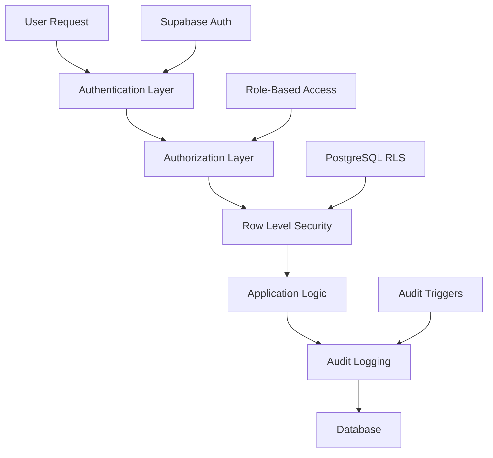

# 🔒 Security Guidelines - Quarter Master Inventory

Comprehensive security implementation covering authentication, authorization, data protection, and compliance.

## 🛡️ Security Architecture



## 🔐 Authentication System

### Supabase Authentication
- **JWT-based tokens**: Secure, stateless authentication
- **Token expiration**: 24-hour expiry with refresh token rotation
- **Password policies**: Minimum 8 characters, complexity requirements
- **Rate limiting**: Built-in protection against brute force attacks

```typescript
// Authentication configuration
export const authConfig = {
  site_url: process.env.NEXT_PUBLIC_SITE_URL,
  redirect_to: `${process.env.NEXT_PUBLIC_SITE_URL}/auth/callback`,
  appearance: {
    theme: 'default',
    variables: {
      default: {
        colors: {
          brand: '#1E3A8A',
          brandAccent: '#3B82F6',
        },
      },
    },
  },
  providers: ['email'],
  options: {
    emailRedirectTo: `${process.env.NEXT_PUBLIC_SITE_URL}/auth/callback`,
  },
};
```

### Multi-Factor Authentication (MFA)
- **TOTP support**: Time-based one-time passwords
- **SMS backup**: Optional SMS verification
- **Recovery codes**: Secure backup authentication method

### Session Management
```typescript
// Session security configuration
export const sessionConfig = {
  timeout: 30 * 60 * 1000, // 30 minutes
  refreshThreshold: 5 * 60 * 1000, // 5 minutes before expiry
  maxConcurrentSessions: 3,
  invalidateOnIpChange: true,
};
```

## 👤 Authorization & Role-Based Access Control

### Role Hierarchy
```
Super Admin (Level 4)
    ├── Full system access
    ├── User management
    ├── System configuration
    └── All lower-level permissions

Admin (Level 3)
    ├── Approve verified receipts
    ├── View all inventory reports
    ├── Manage department users
    └── All lower-level permissions

User (Level 2)
    ├── Verify submitted receipts
    ├── Create and edit own receipts
    ├── View assigned receipts
    └── All lower-level permissions

Semi User (Level 1)
    ├── Create draft receipts
    ├── Edit own draft receipts
    └── View own receipts
```

### Permission Matrix

| Action | Semi User | User | Admin | Super Admin |
|--------|-----------|------|-------|-------------|
| Create Receipt | ✅ | ✅ | ✅ | ✅ |
| Edit Own Draft | ✅ | ✅ | ✅ | ✅ |
| Submit Receipt | ✅ | ✅ | ✅ | ✅ |
| Verify Receipt | ❌ | ✅ | ✅ | ✅ |
| Approve Receipt | ❌ | ❌ | ✅ | ✅ |
| View All Receipts | ❌ | ❌ | ✅ | ✅ |
| Manage Users | ❌ | ❌ | ❌ | ✅ |
| View Audit Logs | ❌ | ❌ | ✅ | ✅ |
| System Settings | ❌ | ❌ | ❌ | ✅ |

### Role Validation Function
```sql
-- Function to check user permissions
CREATE OR REPLACE FUNCTION user_has_permission(
    user_uuid UUID,
    permission_name VARCHAR(50)
) RETURNS BOOLEAN AS $$
DECLARE
    user_permissions JSONB;
BEGIN
    SELECT COALESCE(r.permissions, '{}'::jsonb) INTO user_permissions
    FROM user_roles ur
    JOIN roles r ON ur.role_id = r.id
    WHERE ur.user_id = user_uuid;
    
    -- Super admin has all permissions
    IF user_permissions ? 'all' THEN
        RETURN TRUE;
    END IF;
    
    -- Check specific permission
    RETURN user_permissions ? permission_name;
END;
$$ LANGUAGE plpgsql;
```

## 🔒 Data Protection

### Row Level Security (RLS)
All sensitive tables implement RLS policies:

```sql
-- Example: Receipt access policy
CREATE POLICY "Users can access receipts based on role and status" ON receipts
    FOR SELECT USING (
        -- Own receipts
        created_by = auth.uid()
        OR
        -- Role-based access
        CASE 
            WHEN status = 'submitted' THEN user_has_permission(auth.uid(), 'verify_receipt')
            WHEN status = 'verified' THEN user_has_permission(auth.uid(), 'approve_receipt')
            ELSE user_has_permission(auth.uid(), 'view_all_receipts')
        END
    );
```

### Data Encryption
- **At rest**: PostgreSQL encryption at database level
- **In transit**: TLS 1.3 for all connections
- **Application level**: Sensitive fields encrypted before storage

```typescript
// Encryption utility for sensitive data
import CryptoJS from 'crypto-js';

export class DataEncryption {
  private static readonly key = process.env.ENCRYPTION_KEY!;
  
  static encrypt(plaintext: string): string {
    return CryptoJS.AES.encrypt(plaintext, this.key).toString();
  }
  
  static decrypt(ciphertext: string): string {
    const bytes = CryptoJS.AES.decrypt(ciphertext, this.key);
    return bytes.toString(CryptoJS.enc.Utf8);
  }
}
```

### Data Sanitization
```typescript
// Input sanitization
import DOMPurify from 'dompurify';
import validator from 'validator';

export class InputSanitizer {
  static sanitizeString(input: string): string {
    return DOMPurify.sanitize(validator.escape(input));
  }
  
  static validateEmail(email: string): boolean {
    return validator.isEmail(email);
  }
  
  static sanitizeFilename(filename: string): string {
    return filename.replace(/[^a-zA-Z0-9.-]/g, '_');
  }
}
```

## 🔍 Audit & Monitoring

### Comprehensive Audit Trail
Every critical action is logged with:
- **User identification**: Who performed the action
- **Timestamp**: When the action occurred
- **Action details**: What was changed
- **IP address**: Where the action originated
- **User agent**: Client information

```sql
-- Audit log structure
CREATE TABLE audit_logs (
    id UUID PRIMARY KEY DEFAULT gen_random_uuid(),
    user_id UUID REFERENCES users(id),
    action VARCHAR(50) NOT NULL,
    table_name VARCHAR(50) NOT NULL,
    record_id UUID NOT NULL,
    old_values JSONB,
    new_values JSONB,
    ip_address INET,
    user_agent TEXT,
    session_id VARCHAR(100),
    created_at TIMESTAMP WITH TIME ZONE DEFAULT NOW()
);
```

### Real-time Monitoring
```typescript
// Security event monitoring
export class SecurityMonitor {
  static async logSecurityEvent(event: SecurityEvent) {
    const { type, userId, details, severity } = event;
    
    // Log to database
    await supabase.from('security_events').insert({
      event_type: type,
      user_id: userId,
      details,
      severity,
      ip_address: getClientIP(),
      user_agent: getUserAgent(),
      created_at: new Date().toISOString(),
    });
    
    // Alert for high-severity events
    if (severity === 'HIGH') {
      await this.sendSecurityAlert(event);
    }
  }
  
  private static async sendSecurityAlert(event: SecurityEvent) {
    // Implementation for security alerts
    // Email notifications, Slack alerts, etc.
  }
}
```

## 🚨 Security Monitoring & Alerts

### Suspicious Activity Detection
- **Multiple failed login attempts**: Auto-lockout after 5 attempts
- **Unusual access patterns**: Geographic or time-based anomalies
- **Privilege escalation attempts**: Unauthorized role changes
- **Data export activities**: Large data download monitoring

### Security Event Categories
```typescript
enum SecurityEventType {
  LOGIN_SUCCESS = 'login_success',
  LOGIN_FAILURE = 'login_failure',
  ACCOUNT_LOCKOUT = 'account_lockout',
  PRIVILEGE_ESCALATION = 'privilege_escalation',
  DATA_EXPORT = 'data_export',
  UNAUTHORIZED_ACCESS = 'unauthorized_access',
  SUSPICIOUS_ACTIVITY = 'suspicious_activity',
}

enum SecuritySeverity {
  LOW = 'LOW',
  MEDIUM = 'MEDIUM',
  HIGH = 'HIGH',
  CRITICAL = 'CRITICAL',
}
```

## 🛡️ Application Security

### Input Validation
```typescript
// Comprehensive input validation schema
import Joi from 'joi';

export const receiptValidationSchema = Joi.object({
  item_name: Joi.string().min(2).max(255).required(),
  description: Joi.string().max(1000).optional(),
  quantity: Joi.number().integer().min(1).max(999999).required(),
  unit: Joi.string().min(1).max(50).required(),
  unit_price: Joi.number().precision(2).min(0).optional(),
  supplier: Joi.string().max(255).optional(),
  purchase_date: Joi.date().max('now').optional(),
});
```

### XSS Prevention
```typescript
// XSS protection middleware
export const xssProtection = (req: Request, res: Response, next: NextFunction) => {
  // Set security headers
  res.setHeader('X-Content-Type-Options', 'nosniff');
  res.setHeader('X-Frame-Options', 'DENY');
  res.setHeader('X-XSS-Protection', '1; mode=block');
  res.setHeader('Content-Security-Policy', 
    "default-src 'self'; script-src 'self' 'unsafe-inline'; style-src 'self' 'unsafe-inline';"
  );
  
  next();
};
```

### CSRF Protection
```typescript
// CSRF token validation
export const csrfProtection = (req: Request, res: Response, next: NextFunction) => {
  const token = req.headers['x-csrf-token'] as string;
  const sessionToken = req.session?.csrfToken;
  
  if (!token || token !== sessionToken) {
    return res.status(403).json({ error: 'Invalid CSRF token' });
  }
  
  next();
};
```

## 📁 File Upload Security

### File Validation
```typescript
export class FileValidator {
  private static readonly allowedTypes = [
    'application/pdf',
    'image/jpeg',
    'image/png',
    'image/gif',
    'text/plain',
    'application/msword',
    'application/vnd.openxmlformats-officedocument.wordprocessingml.document',
  ];
  
  private static readonly maxFileSize = 5 * 1024 * 1024; // 5MB
  
  static validateFile(file: File): ValidationResult {
    // Check file type
    if (!this.allowedTypes.includes(file.type)) {
      return { valid: false, error: 'File type not allowed' };
    }
    
    // Check file size
    if (file.size > this.maxFileSize) {
      return { valid: false, error: 'File size exceeds limit' };
    }
    
    // Check filename
    const filename = this.sanitizeFilename(file.name);
    if (filename !== file.name) {
      return { valid: false, error: 'Invalid filename characters' };
    }
    
    return { valid: true };
  }
  
  private static sanitizeFilename(filename: string): string {
    return filename.replace(/[^a-zA-Z0-9.-]/g, '_');
  }
}
```

### Virus Scanning
```typescript
// File scanning integration (example with ClamAV)
export class VirusScanner {
  static async scanFile(filePath: string): Promise<ScanResult> {
    try {
      const clamscan = await new NodeClam().init({
        removeInfected: true,
        quarantineInfected: false,
        debugMode: false,
      });
      
      const result = await clamscan.scanFile(filePath);
      
      return {
        isInfected: result.isInfected,
        viruses: result.viruses || [],
      };
    } catch (error) {
      throw new Error(`Virus scan failed: ${error.message}`);
    }
  }
}
```

## 🔐 Environment Security

### Environment Variables
```bash
# Production environment variables
NODE_ENV=production
DATABASE_URL=postgresql://encrypted_connection_string
JWT_SECRET=strong_random_secret_256_bits
ENCRYPTION_KEY=another_strong_random_key_256_bits
SUPABASE_URL=https://your-project.supabase.co
SUPABASE_ANON_KEY=your_anon_key
SUPABASE_SERVICE_ROLE_KEY=your_service_role_key

# Security configuration
CORS_ORIGIN=https://your-domain.com
SESSION_TIMEOUT=1800000
MAX_LOGIN_ATTEMPTS=5
LOCKOUT_DURATION=900000

# File upload security
MAX_FILE_SIZE=5242880
ALLOWED_FILE_TYPES=pdf,jpg,jpeg,png,gif,txt,doc,docx
UPLOAD_PATH=/secure/uploads/
VIRUS_SCAN_ENABLED=true
```

### Secrets Management
```typescript
// Secrets management utility
export class SecretsManager {
  private static secrets: Map<string, string> = new Map();
  
  static async loadSecrets() {
    // In production, load from secure vault (AWS Secrets Manager, etc.)
    if (process.env.NODE_ENV === 'production') {
      await this.loadFromVault();
    } else {
      await this.loadFromEnv();
    }
  }
  
  static getSecret(key: string): string {
    const secret = this.secrets.get(key);
    if (!secret) {
      throw new Error(`Secret ${key} not found`);
    }
    return secret;
  }
  
  private static async loadFromVault() {
    // Implementation for production secret loading
  }
  
  private static async loadFromEnv() {
    // Load from environment variables for development
    this.secrets.set('JWT_SECRET', process.env.JWT_SECRET!);
    this.secrets.set('ENCRYPTION_KEY', process.env.ENCRYPTION_KEY!);
  }
}
```

## 🚧 Security Best Practices

### Code Security
1. **Input validation**: Validate all user inputs
2. **Output encoding**: Encode data before display
3. **Parameterized queries**: Prevent SQL injection
4. **Secure headers**: Implement security HTTP headers
5. **Dependency scanning**: Regular security updates

### Deployment Security
1. **HTTPS only**: Force SSL/TLS connections
2. **Secure cookies**: HttpOnly and Secure flags
3. **CORS configuration**: Restrict cross-origin requests
4. **Rate limiting**: Prevent abuse and DoS attacks
5. **Security monitoring**: Real-time threat detection

### Data Security
1. **Encryption**: Encrypt sensitive data at rest and in transit
2. **Access controls**: Implement principle of least privilege
3. **Audit logging**: Comprehensive activity tracking
4. **Data retention**: Secure data lifecycle management
5. **Backup security**: Encrypted and tested backups

## 📋 Security Checklist

### Pre-Deployment Security Review
- [ ] All authentication mechanisms tested
- [ ] Authorization policies verified
- [ ] Input validation implemented
- [ ] SQL injection tests passed
- [ ] XSS protection verified
- [ ] CSRF protection implemented
- [ ] File upload security tested
- [ ] Audit logging functional
- [ ] Security headers configured
- [ ] Secrets properly managed
- [ ] Database security policies active
- [ ] Backup procedures tested
- [ ] Incident response plan ready

### Regular Security Maintenance
- [ ] Security patches applied
- [ ] Dependencies updated
- [ ] Access reviews conducted
- [ ] Audit logs reviewed
- [ ] Security metrics monitored
- [ ] Penetration testing scheduled
- [ ] Security training completed
- [ ] Compliance requirements met

---

This security framework ensures the Quarter Master Inventory System meets enterprise-grade security standards while maintaining usability and performance.
